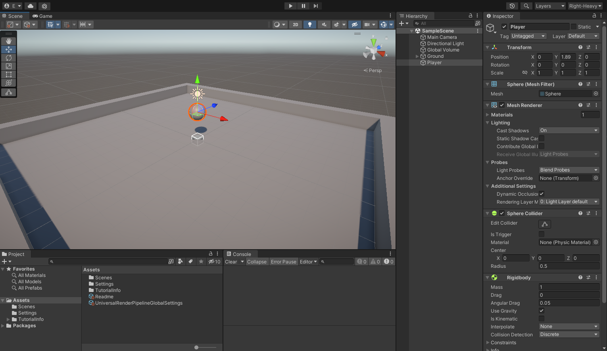

# Introduction to the Editor
*By Jake Rogers*

## Introduction
This article will familiarize new Unity users with some important features of the editor.  

The article is pretty much a written version of my YouTube video linked below, it is recommended to watch that to learn the editor, and use this article as a reference later.

!!! YOUTUBE VIDEO !!!

## Overview
Upon opening Unity, you will be presented with the default layout of Unity's most important windows. Here is a brief breakdown of each window's function:

* **Project**
    * Shows you your project's file system. More importantly, it allows you to create Unity specific files such as new materials, scenes, scripts, etc.
    * Files here can be selected in order to edit them in the inspector (upcoming).
* **Console**
    * Logs the INFO, WARN, and ERROR messages created by any script in your project. Think of it as where you would print "Hello World!" to in your first program.
    * Most of the time (hopefully), this window will be empty while you are not in Play Mode, but it is possible to get console output while just using the Editor.

* **Scene View**
    * Your view into your game's current scene as an *editor*, you can freely position the camera in this view.
    * Compared to the *game* view, you will see gizmos and widgets in your game world, have the ability to enable special rendering modes (wireframe, unlit), and *select GameObjects in the hierarchy by clicking on them*.

* **Game View**
    * This view (mostly) directly mimics what your scene looks like when in Play mode. You will see the scene through the perspective of the scene's main camera.

* **Hierarchy**
    * This very important window shows you all of the GameObjects within the currently active scene, as well as presenting them in a hierarchical manner if any GameObjects are nested within each other (they won't be for a fresh project).
    * From this window, GameObjects can be inspected, renamed, re-parented, and more.
    * Learn more about the very important topic of [Scene Hierarchies]()

* **Inspector**
    * This window is your best friend. Any currently selected GameObject or file in the Project window will show up in the Inspector. From there, you will have the ability to edit all kinds of properties of the item, as well as the properties of components for GameObjects.

There are many, many more windows which can be spawned by using the Window dropdown at the top of the Editor, but they usually are not important enough to have docked at all times.

### Editor Layouts
The editor's layout can be re-organized in practically any way you desire. To do so, simply drag the tab representing the window to another location. You can split docks into two, tabulate them with other windows in a dock, or push them along the sides to create new docks. They can also of course be resized.  
Frankly, just try dragging a window all over the editor to see what options are available.

#### Save Layouts
If you change your layout from the default, it may reset back to the default the next time you open the editor. Therefore, you should **save your current layout** using the drop down in the top left.

Keep in mind, you can save multiple layouts for different workflows- have a workflow completely dedicated to animation or compositing.

#### Chef's Special
I personally find the default layout annoying, since you have to drag your mouse across the entire screen to go back and forth between the Hierarchy and the Inspector windows- something I do often.

My 'Right-Heavy' layout moves the Hierarchy to be docked just left of the Inspector, which also gives me a nice and large dock for the Scene and Game views.  
Additionally, I often use Editor scripts which may print to the Console while I am in edit mode, so I split the Console and Project windows into two docks along the bottom so they are always open.

##
## Conclusion