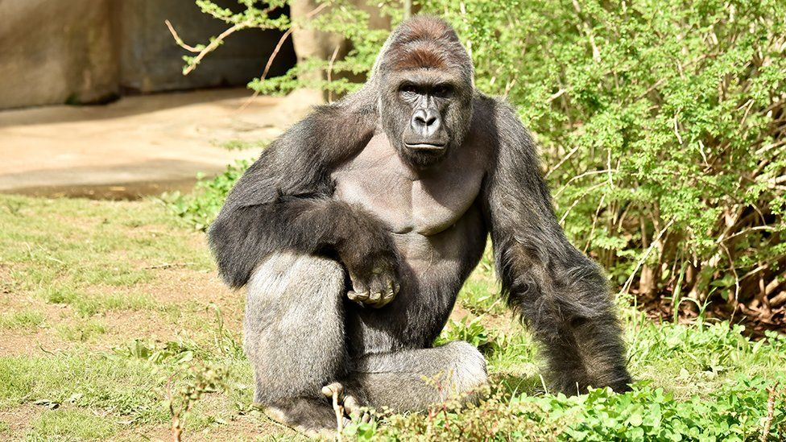

# Additive Scene Loading
By Harry Kerry

Contributions by Byler Berry

## Intro
Here is where I would tell you about additive scene loading. Instead, here is a picture of a giraffe linked from the internet.

### Picture of a Giraffe

## Technique
Now that you are properly equipped, here is a picture of a *particular gorilla* linked from a local file.

### A Real Gorilla

## Consequences of Poor Preparation
The things you learn here can prevent devastating memetic attacks, such as those seen below in the embedded youtube video.
<iframe width="560" height="315" src="https://www.youtube.com/embed/2VOvEFHDOaU" title="YouTube video player" frameborder="0" allow="accelerometer; autoplay; clipboard-write; encrypted-media; gyroscope; picture-in-picture; web-share" allowfullscreen></iframe>

## Further Reading
You are now armed with intense, potentially dangerous knowledge. Project any violent thoughts into this local gif file.

