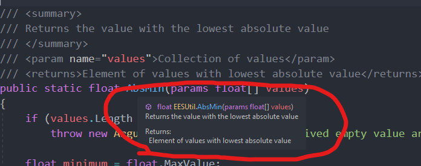

# C# Coding Tricks
*By: Jake Rogers*<br/>
*Created: September 4th, 2023*

## Overview
This guide serves as an introduction to a plethora of coding features for the C# programming language as it pertains to video game scripting. This is made as a useful primer for those familiar with other statically typed languages, but are newer to C# (or just happened to miss learning some of these techniques).

Note that inclusion here doesn't indicate "Best Practice", it's just nice to know as an option or when reading code produced by others. 

???+ tip
    You can right-click on Table of Contents entires and *Copy Link Address* to get a link directly to a particular entry on this page!

---

## Short-hands & Convenience Features

### Expression Bodies
Expression bodies are a convenient way to write brief one liners within a class:
```cs linenums="1"
private int width;
private int height;

// Traditional
public void MultiplyWidthLong(float magnitude)
{
    width *= magnitude;
}

// Expression bodies (Does the same as above)
public void MultiplyWidth(float magnitude) => width *= magnitude;

//****

// Traditional
public int CalculateAreaLong()
{
    return width * height;
}

// Note: 'Return' is implicit
public int CalculateArea() => width * height;
```
This can also be particularly useful to write simple event handlers.

Note that there was no need to specify `return` on a non-void expression bodied function: It is assumed that the one-liner will return the result of the instruction.

[Learn More](https://learn.microsoft.com/en-us/dotnet/csharp/programming-guide/statements-expressions-operators/expression-bodied-members)

---

### Lambda Expressions

Some functions may themselves call for a reference to a different function within their parameter list. Lambda Expressions, written similarly to Expression Bodies, can create Anonymous Functions as an argument rather than having to write down the function separately:
```cs linenums="1"

// 'processorFunc' accepts any function with one int parameter and returns an int.
private void ProcessArray(ref int[] values, Func<int, int> processorFunc)
{
    for (int i = 0; i < nums.Length; i++)
    {
        nums[i] = processor(nums[i]);
    }
}

private int MinusOne(int x) => x - 1;

private void foo()
{
    int[] nums = {1, 2, 3, 4};
    
    // Traditional use: Pass an existing function
    ProcessArray(ref nums, MinusOne);   // {0, 1, 2, 3}

    // Lambda Function: Create the expression in-line
    ProcessArray(ref nums, (int x) => x + 5); // Add 5 to each element. {5, 6, 7, 8}
    ProcessArray(ref nums, (int x) => x * 10); // 10x each element. {50, 60, 70, 80}

}
```

This is very useful when dealing with higher-level design strategies which allow functions to be passed in to configure the behavior of a construct, such as Object Pools and State Machines.

[Learn More](https://learn.microsoft.com/en-us/dotnet/csharp/language-reference/operators/lambda-expressions)

---

### Format Strings
#### string.Format
`string.Format` allows you to emplace placeholders into a string for cleaner and more modular string formatting:
```cs linenums="1"
string firstName = "John";
string lastName = "Doe";
float netWorth = 1894731.2168784215;

Console.WriteLine(
    string.Format("Member: {0}, {1} | Net Worth: ${2:0.00}",
    lastName,
    firstName,
    netWorth));
// Doe, John | Net Worth:  $1894731.21
```
The placeholders can be given additional formatting to change how the string is emplaced. For example, the Net Worth display was set to only print two decimals. [Visit the docs to see all the options](https://learn.microsoft.com/en-us/dotnet/api/system.string.format?view=net-7.0).

---

#### Interpolated Strings
Interpolated Strings (known as *format strings* in other languages) are a less versatile but very convenient way of formatting a string. 

Invoke them by putting `$` in front of a string literal and using `{...}` to emplace variables. Expressions also work.

```cs linenums="1"
string firstName = "John";
string lastName = "Doe";
float netWorth = 1894731.2168784215;

Console.WriteLine($"Member: {lastName}, {firstName} | Net Worth: ${netWorth}");
// Doe, John | Net Worth: $1894731.2168784215
```
Interpolated strings are very convenient, and remove the need to do ugly string concatenation (I.E `"a = " + a + ", b = " + b;`).

---

### Constructor Reuse
When writing multiple constructors for the same class, it can be useful to reuse the implementation of another constructor when writing a larger one:

```cs linenums="1"
public class Damager
{
    float DamageAmount;
    float ArmorPenetration;
    DamageType DamageType;
    float DebuffBuildUp;

    public Damager()
    {
        DamageAmount = 1;
        ArmorPenetration = 0f;
        DamageType = DamageType.Ballistic;
        DebuffBuildUp = 0f;
    }

    // Calls the default constructor with the damage amount and type specified,
    // but penetration and build up defaulted to 0.
    // Note that the brackets are intentionally left empty, as no further definition is necessary.
    public Damager(float damageAmount, DamageType damageType) 
        : this(damageAmount, 0f, damageType, 0f) { }

    // Only specify damage. Default penetration to 0, type to fire, and 15 build up
    public Damager(float damageAmount) : this(damageAmount, 0f, DamageType.Fire, 15f);
}
```
In the example above we create a fully-encompassing constructor to initialize every member. Then, we create more specific constructors which allow only a few fields to be specified while all others use a default value.

---

## Properties
Properties can be described as more advanced data accessors for a class. They provide cleaner ways to implement things such as Getters & Setters and shorthand accessors. 

### Getter / Setters
The *Getter / Setter* pattern can be written fairly easily via properties. The below example allows the private `healthPercentage` to be accessed publicly, and written to with some error checking:
```cs linenums="1"
public class CharacterHealth
{
    private float healthPercentage;

    public float HealthPercentage
    {
        get { return healthPercentage; }
        set { healthPercentage = Mathf.Clamp01(value)} // Disallow setting outside of the [0, 1] domain
    }
}
// In another class....
private void foo()
{
    CharacterHealth health;
    health.HealthPercentage = 20.5;    // Value gets clamped to 1, healthPercentage is now 1.
    
    Console.Log(health.HealthPercentage)
}
```

The above could also be written like so using [expression bodies](#expression-bodies):
```cs linenums="1"
public class CharacterHealth
{
    private float healthPercentage;

    public float HealthPercentage { get => healthPercentage; set => Mathf.Clamp01(value); }
}
```

[Learn More](https://learn.microsoft.com/en-us/dotnet/csharp/programming-guide/classes-and-structs/using-properties)

---

### Write Restricted Public Member
Properties can also be used to create regular public members that have restricted set access:

```cs linenums="1"
public float HealthPercentage { get; private set;} 
// This member can be gotten externally, but only written internally.
```

Note that this differs from a `readonly` member, as readonly members cannot be reassigned by any scope once the class' constructor exits.

---

### Derived Properties

Properties can also allow the results of functions to be returned in a way similar to member fields. This is useful for creating derived or composite fields which are accessed in ways similar to a public member:

```cs linenums="1"
public class Rectangle
{
    public float width = 2;
    public float height = 5;

    public float Area { get => width * height; }
}

// In another class...
private void foo()
{
    Rectangle r;
    Console.WriteLine(r.Area) // 10
    // Note: Area is not accessed like a function using '()'.
}
```

---

## Functional Features

### Parameter Modifiers
Here are a few things you can do with parameters to functions you write:

#### Pass By Reference (`ref`) Modifier
Similar to other languages, objects passed as `ref` are passed as a direct reference to the object given as a parameter rather than a copy. This means changes to said `ref` parameter in the function will directly change the original variable rather than a copy.

* `ref` **requires** that the parameter be initialized before it can be passed into the function.
* Calling function must use the `ref` keyword when providing the `ref` argument.
* Read more on [Pass By Reference](https://learn.microsoft.com/en-us/dotnet/csharp/language-reference/keywords/ref).

```cs linenums="1"
class Quad
{
    public int Width;
    public int Height;

    Quad(int width, int height) 
    {
        Width = width;
        Height = height;
    }

    Print() => Console.WriteLine($"Width: {Width} | Height: {Height}");

}

private void foo(ref Quad s)
{
    s.Width *= 2;
    s.Height *= 2;
}

private void bar()
{
    Quad q;
    // Note, calling foo with q would be illegal because
    // it is not initialized yet!
    q = new Quad(5, 10);

    foo(ref q); // Note: Must use 'ref' before any ref parameter
    q.Print(); // Width: 10 | Height: 20
}
```

---

#### `out` modifier
`out` works similarly to Pass by Reference, with two major differences:

1. The `out` parameter no longer needs to be initialized prior to usage in the function call. In fact, it doesn't even need to exist, as the compiler will declare the variable for you if it doesn't exist.
2. A function with `out` parameters must ensure that all `out` parameter get initialized at the end of all code paths.

```cs linenums="1"
private void foo(out int number) => number = 10;

private void bar()
{
    foo(out int num);
    Console.WriteLine(num); 
    // Perfectly legal, num is declared and initialized by foo!
}
```

This is a nice way to implement functions which like to return more than one value (Assuming you don't want to use a [tuple](#tuples)).

[Learn More](https://learn.microsoft.com/en-us/dotnet/csharp/language-reference/keywords/out-parameter-modifier)

---

#### `params` Modifier

`params`: Parameter arrays allow callers of the method to provide an any-sized list of parameters, which will then be received as an array.

* Parameter arrays *must* be the final parameter in the signature, as there is no delimiter to stop adding elements to the array.
* The caller can also pass in an array as well, as long as it matches the type of the parameter array.
* An empty array is also valid.

```cs linenums="1"
private void PrintNums(params int[] nums)
{
    foreach (int x in nums)
    {
        Console.Write($"{x},");
    }
}


private void Foo()
{
    PrintNums(1, 5, 7, 10); // 1, 5, 7, 10,
    PrintNums(5, 6, 7, 8, 9, 10, 11, 12, 13, 14, 15);   // 5, ..., 15,
    PrintNums() // (Empty is also valid: Nothing printed.)

    int[] nums = {10, 20, 30};
    PrintNums(nums) // 10, 20, 30,
}
```

[Learn More](https://learn.microsoft.com/en-us/dotnet/csharp/language-reference/keywords/params)

---

#### Named and Optional Parameters
Optional Parameters allow parameters to be ignored or provided by the calling function. If ignored, they will use a default value.

* Optionals must be defined at the end of the parameter list in a block, as required (AKA 'normal') parameters need to be referenced positionally.
* The calling function specifies which optionals to provide by referencing their name.

```cs linenums="1"
private void WeirdCalculation(
    float a, float b, float sigma=0.5, float mu=1.0) {/*...*/}

private void foo()
{
    WeirdCalculation(10, 5, mu=1.5);
    // Sigma uses default of '0.5' since we didn't specify.
}
```
In C#, function calls can provide parameters by name rather than positionally.

* This can be useful for code readability, as it strongly associates the parameter with it's purpose in the function.
* You can mix named parameters with positional parameters as long as the overall positioning of all parameters isn't violated. However, it is usually best to either use all named arguments in a function call, or none at all.

```cs linenums="1"
private void foo(string firstName, string lastName, int age, float height) {/*...*/}

private void bar()
{
    foo(firstName: "John", lastName: "Doe", age: 50, height: 140);
    
    // Any order is fine as long as they are all named.
    foo(age: 30, height: 30, lastName: "Mann", firstName: "Mini");

    //This is technically fine.
    foo(firstName: "Biggy", "Brigs", age: 15, height: 2000);

    // This is ->not<- fine!
    foo(age: 15, "Iam", "Afailure", 145);
}
```

### XML Documentation
XML Documentation is a .NET standard for in-file C# documentation. Following the standard allows your code to be automatically attributed with documentation by various doc parsers.

For example, using XML doc on a function allows the details of the function to be provided in compatible IDE tooltips.
```cs linenums="1"
/// <summary>
/// Returns the value with the lowest absolute value
/// </summary>
/// <param name="values">Collection of values</param>
/// <returns>Element of values with lowest absolute value</returns>
public static float AbsMin(params float[] values) {/*...*/}
```

Visual Studio's IntelliSense will generate the following tooltip when `AbsMin` is invoked or hovered over:


When writing a function with `param` tags, each respective `param` doc will show up as it is being provided in the function call.

It is best to read the relevant [.NET doc page](https://learn.microsoft.com/en-us/dotnet/csharp/language-reference/xmldoc/recommended-tags) for more details. Some IDEs (such as Visual Studio) will automatically generate a skeleton for the docs when you write `///` above a function or class definition.


---

### Tuples
C# can enclose multiple variables into a *Tuple*. This is especially useful for returning multiple pieces of related data from a function:

```cs linenums="1"
// Note: Return type is a (float, float) tuple
private (float latitude, float longitude) GetGPSLocation()
{
    return (15.1568752, 184.12019);
}

private void foo()
{
    // Use the 'var' auto typer to get tuples.
    var location = GetGPSLocation();
    Console.WriteLine(
        $"Latitude: {location.latitude} | Longitude: {location.longitude}");
}

```
Note that the members of a tuple are referenced by name. Also, the `var` keyword works similarly to `auto` in C, the data type is assumed from the right-hand side of the assignment.

- [Learn More (Tuples)](https://learn.microsoft.com/en-us/dotnet/csharp/language-reference/builtin-types/value-tuples)
- [Learn More (var)](https://learn.microsoft.com/en-us/dotnet/csharp/programming-guide/classes-and-structs/implicitly-typed-local-variables)

### LINQ
Language Integrated Queries (LINQ), in short, allow you to run SQL-style commands on enumerable collections, such as Lists, arrays, etc. This allows you to interact with object collections in a way similar to a database.

While this is typically overkill on many standard collection operations, it can be useful for smart manipulation or extraction of data from very large collections. Video games often have an internal database of object definitions (Items, Weapons, characters, stats, etc) which can leverage LINQ.

Here is an example taken from [Microsoft's .NET Documentation Site](https://learn.microsoft.com/en-us/dotnet/csharp/linq/)<sup>1</sup>:

```cs linenums="1"
#using System.Linq; // Note: LINQ must be included for use.

// Specify the data source.
int[] scores = { 97, 92, 81, 60 };

// Define the query expression.
IEnumerable<int> scoreQuery =
    from score in scores
    where score > 80
    select score;

// Execute the query.
foreach (int i in scoreQuery)
{
    Console.Write(i + " ");
}

// Output: 97 92 81
```

It is worth noting that the creation of a *query expression* (line 7 of the example above) does **not** execute the query. It creates a construct whose execution is then deferred to a later step (the `foreach` in the above example)

Including the LINQ library into your file also grants you access to some useful collection operations, such as `FirstOrDefault`, `Count`, `Distinct`, `Max`, `OrderBy`, `Select`, and much more.

`FirstOrDefault` is particularly useful, as it allows you to get the first item out of a collection while specifying a fallback (the `default`) if the collection is empty.

It is best to take some time to read over the following MS .NET Doc pages to learn more:

* [LINQ Overview](https://learn.microsoft.com/en-us/dotnet/csharp/linq/): An overview of what LINQ is.
* [Introduction to LINQ Queries](https://learn.microsoft.com/en-us/dotnet/csharp/programming-guide/concepts/linq/introduction-to-linq-queries): A practical look into how LINQ is used.
* [System.LINQ.Enumerable Methods](https://learn.microsoft.com/en-us/dotnet/api/system.linq.enumerable?view=net-7.0): Additional collection methods provided by including the LINQ library.

## References

1. [Microsoft's .NET Documentation Page](https://learn.microsoft.com/en-us/dotnet/)