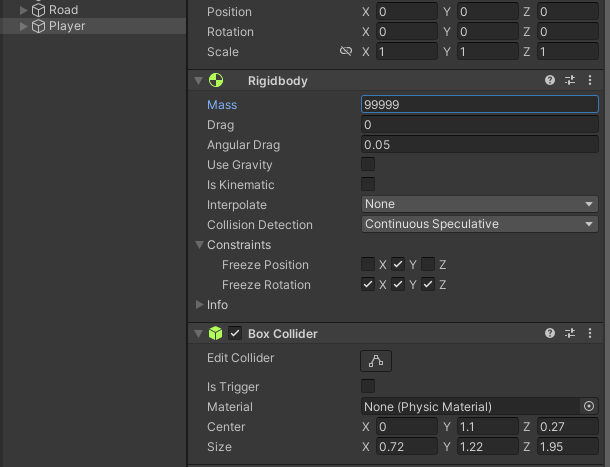

# Welcome to Rocket Runner!
*By Jake Rogers*

## Tutorial Video
For those who prefer videos to textual guides, this guide will eventually have an accompanying YouTube video to follow along!

## Chapter 0: Project Set-Up

We created a project for this game in [one of the previous steps in the series](./unity-first-step-new-proj.md), but we still have some housekeeping to take care of now that we have dropped into the editor.

1. Download and import the project assets.
2. Enable the Unity Input System.

### 1) Import the Project Assets
We actually do not need many external assets here, but I have created a few so that we have something nicer to look at than some primitives.

[Download the Assets Here](https://www.mediafire.com/file/j0z39166faq7ezl/rocket-runner-assets.zip/file)

Inside the zip file you downloaded, there is a *Models* and *Textures* folder which you will need to move into your project's asset folder. You can do this by using your operating system's file browser, or by just dragging and dropping them into Unity's Project window.


#### What the Heck is this Stuff?
The `Models` folder contains an FBX (3D model file) *Octahedron* I made, which is a useful shape for indicating direction. We will use it for both our player and our missile objects.

The `Textures` folder contains a 128x128 grid texture which we will use for the ground, as it would be difficult to perceive movement against a ground with no texture. You may want to hang onto this texture, since it is a useful placeholder to have on hand in other projects.

### 2) Enable the Unity Input System
By default, Unity projects come loaded with what is called the Legacy Input Manager, a system which Unity used to use to allow reading player input into game scripts.

While it is still a fully servicable way to capture player input (and in many ways, easier to initially set up), 2019 brought forward the 1.0 release of the new *Input System* package. The Input System offers a significantly more sophistocated design for managing player input across multiple devices, processing player input, reading input events, and much more than can be explained here.

The new Input System should be considered the 'canonical' way of capturing player input. Even though it is a bit tougher to learn, the greater degree of control will be of great use when you expand into bigger projects!

#### Install the Input System Package
You can (and should) install the Input System package using the editor itself. Along the top, use the dropdown windows to select `Window > Package Manager`

From there, switch the Packages displayed from `Packages: In Project` to `Packages: Unity Registry` to see packages available for download. Scroll down to the Input System, select it, and install.

Once installation is complete, a dialog box will pop up informing you that Unity needs to be rebooted to enable the Input System backend, which you should do.

NOTE: Once rebooted, you can return to the package to download some Input System sample scenes, which can be useful for figuring out how to work with it in future projects. You do not have to do that for this guide.

## Chapter 1: Scene Groundwork
Our game's environment will be a long road (going in the positive Z-axis direction) with two walls to keep the player in. That is easy enough to accomplish with a plane and two cubes!

We will also construct our player in this stage as well.

1. Create the Road
2. Create the Player
3. Apply Materials

### 1) Create the Road

In the Hierarchy Window, right-click on any empty space and create a plane (`3D Object > Plane`) and **one** cube (`3D Object > Cube`).

Select the two objects and reset their positions to `(0, 0, 0)` if they aren't already.

To make our road, we will resize the plane by setting its scale to `(1.5, 1.0, 10)`. This will make our road a bit wider and much longer in the Z-Axis. Rename the Plane to *Ground*.

We want to create 'railings' along our road which will stop the player from going off of it- our cube will serve this purpose. Resize it to be the same length as the ground by setting its Z scale to 100*. Also make the cube wider by changing its X scale to 2.

\* Note that the Plane primitive actually has a default size of 10 meters by 10 meters, and scaling it by 10 in the Z-Axis stretches it to 100 meters. This is why the cube must be resized to 100 and not 10, because the Cube is unitary (One meter cubed).

We will need to move the cube to block the edges of the plane, so change its position to be `(8.5, 0.5, 0)`. Rename the cube to *Right Wall*

We also, of course, need a left wall. Make life easier for yourself by duplicating the right wall! Select the Right Wall and press `Ctrl+D` to duplicate the GameObject. Then, change the new wall's X Position to `-8.5`, and rename it to *Left Wall*.

#### Grouping
These three GameObjects make up our road. Since we realistically always want them to keep their positions and scales relative to eachother, we should 'group' them together by making them siblings of one GameObject.

Right-Click on the Hierarchy and select `Create Empty`, and rename the newly created GameObject to *Road* (Be sure to set its location to (0,0,0) if necessary) Select the *Ground, Right Wall, and Left Wall* and drag-and-drop them on top of the *Road* to make them children of that GameObject.


Now, if you select the *Road* object and move it, you will see all of its children move together with it! The Hierarchy also allows you to fold away children, which helps de-clutter the Hierarchy.

In fact, let's move the road forward on the Z-Axis by 45, since we want the start of the road to be near the origin point.


### 2) Create the Player

Let's get started on our player. As a reminder, they will be a small Octohedron floating a bit off the ground, traveling forward in the Z-Axis.

#### Player Model

Start by creating an empty GameObject at the scene origin (0, 0, 0) and name it *Player*. Then, create a new empty GameObject as a child of the Player called *Player GFX* (Player Graphics).

In your Project window, navigate to the Models folder and drag-and-drop the *Octohedron.fbx* file onto the Player GFX object. You should see a rather large model appear. Select the newly created Octohedron model and scale it down to a more reasonable size, like `(0.4, 0.4, 0.4)`.

As mentioned previously, we want the player to look like they are floating, select *Player GFX* and move its Y Position up. `1.2` is a good number.


#### :octicons-question-16: Why Are we Doing it This Way?
You may be wondering why we have chosen to structure our player this way. Why not just use the Octohedron as our player root, for example? There is no immediate reason why you cannot do this, but it will bite you in the future.

For starters, many complex GameObjects will often need to consist of multiple GameObjects rooted under the same parent (similar to the *Road* we made earlier). Since children inherit their parent's Transforms (positions, rotations, and scales), we want to try and separate the hierarchy of unrelated items in our object as best as possible.

For example, later we will make our Octohedron model spin as it flies through the level. If we had everything parented to our Octohedron model, it would make **everything** on the player spin, which would be a huge mess!

Therefore, we create a GameObject specifically for the player's graphical representation, and put the Octohedron under that. By then moving the GFX up a bit, we move the model up as well. That way, any other graphical objects we have will all be vertically aligned, and our Octohedron can spin without any side effects.

Further, the position of the top-most GameObject in any object is often considered that collective object's 'True Position'. It is also often a useful notion to have an object's position be somewhere along the ground below its center of mass.

Our player is represented by a the Octohedron, but we would like its position to be described as somewhere along the X-Z plane, and the Y position is always 0 for simplicity's sake. So we keep the root GameObject at Y=0, but move the graphical representation of the player up a bit.

The benefits of this are a bit too difficult to explain out of context, but it will make more sense as we develop our player object (and as you make some inevitable mistakes in your own projects!). The way your organize and object's sub-hierarchy is very important when you start creating more complex things!

### 3) Apply Materials

Just like we did in the editor introduction, we will add some color to our scene by creating and applying some materials.

#### Add some color

Since this is already explained in [Introduction to the Editor](../../../articles/unity-articles/unity-editor-introduction.md#add-some-color), we will be brief here.

Create a `Materials` folder and add three materials, *Ground*, *Wall*, and *Player* and apply them to their respective objects by drag-and-dropping in the Scene window. I personally used a light-cyan for the ground, a dark blue for the walls, and a magenta for the player.

#### Grid Texture

Ah, but I mentioned we had a texture for the ground, let's add this now! Textures need to be added to 3D objects through materials, so select your *Ground* material. On its Base Map property which you used to change its color, click on the selector button (a circle with a dot in the middle) and search for then pick the `Grid-sprite` texture.

The result that you get from doing this is... Not quite right. The texture is there, but it is stretched across the entire road! We were hoping to get a repeating 'tiled' texture.

This is easy to fix. Lower down in the material properties, change the Tiling settings to `X: 3, Y: 20`. This basically tells the shader that it should make the texture 3 times smaller in the X direction, 20 times smaller in the Y, and then repeat the texture to compensate. This resizes the texture to be 1:1 in scale tiled across the plane.

The numbers 3 and 20 are picked because the scale of our plane is `(1.5, 1, 10)`- we use the scale numbers then multiply by two to account for the length in both directions (Z translates to Y when it comes to the texture).

Your scene should look something similar to the following:


## Chapter 2: Player Locomotion
We are ready to get our player moving! As previously mentioned, our player should constantly move forward down the road (positive Z)- they will have no control over that. They, however, will also be able to **strafe left and right to control their position on the road** (X axis), which will involve player input.

Additionally, we want our player to collide with the walls of the road so they cannot escape, and we will need to come up with some solution to have our camera follow the player as they sail off into the distance.

1. Set Up Physics for the Player
2. Moving Forwards
3. Bring the Camera With!
4. Player Actions
5. Strafing

### 1) Set Up Physics For the Player
As mentioned above, we need our player to collide with various objects throughout the scene to keep them in the playable space and for other purposes later. Of course, collision detection in 3D space is not a trivial matter, so we will use Unity's Physics to handle detection for us.

However, the *movement* of our player is not going to be physically simulated- in fact, we want the player to have tight control over their character, so we will be foregoing drag simulations, inertia, mass, etc., we **only** want collision.

#### Rigidbody Component
Select the *Player* GameObject and, using the Inspector, do `Add Component > Rigidbody` by using the button at the bottom of the Inspector. Rigidbodies also need a collider component *somewhere* on the same GameObject or a GameObject in its children.

#### Add a Collider
Colliders dictate the physical space an object takes up within the Physics system, and are used for detecting collisions. Question is, which GameObject should we put our collider on?

The obvious answer is on the Octohedron model. After all, the player's collision ought to most closely resemble the player's graphical representation, right? That is reasonable, but in the future, we may want our player's model to rotate or move up and down for special effects, and **we don't want to be radically changing the player's collision boundaries when we do that**.

Imagine if our player was trying to navigate a very narrow corridor, and all of a sudden one of our graphical effects caused the Octohedron to spin sideways, **which then collided them with a wall and forced them to fail**.

No, we want to have collision without locking ourselves out of being able transform the player model. Realistically, we only want to designate an abstract space *in the middle* of the player which is used for collision detection- a 'hitbox' so to speak. **Therefore, let's attach our collider to the *Player* root object**. That way, we don't have to worry about any changes to our graphics objects affecting our collisions.

Theory aside, select the *Player* and do `Add Component > Box Collider` from the Inspector. You should now see a green box in the scene for the player. Using the settings on the Box Collider component, we can adjust its size and center to vaguely wrap it around the Octohedron's normal position. The 'Edit Collider' toggle button allows you to use Gizmos to adjust it in the Scene view, which is highly recommended.

Position and size your box collider to the approximate size of the Octohedron, and drag the bottom side down a bit so it can collide with the walls better.

**Protip: make the X & Z size of the collider slightly *smaller* than the actual Octohedron**. As it turns out, your game will often feel better if the player's collision is a tad smaller than it seems it should be. Perfectly accurate colliders make it feel like you are "getting caught" on things all the time, and smaller colliders let players feel like they are narrowly dodging around things all the time.


Here is what my collider looks like. Notice it extends a bit lower so we can get good contact with the walls, and it doesn't fuller enclose the actual model. You can copy my `Center` and `Size` settings if you are having difficulty getting yours right.

#### Rigidbody Configuration

Returning back to the Rigidbody component, our player now has physics. In fact, if you were to raise it a bit higher up and enter play mode, you would see it fall to the ground. As I mentioned before, we do not want things like gravity and drag affecting our player's movement- we want to handle positioning purely through scripts we are going to make.

Fortunately, Rigidbodies have a setting specifically for this: **Set the *Is Kinematic* property on the Rigidbody component to true**.

Furthermore, change the Collision Detection mode from `Discrete` to `Continuous Speculative`. This will give us a more accurate (but slightly more expensive) collision detection solution so that we do not wind up clipping through obstacles at high speeds.

### 2) Moving Forwards
It is not too difficult to get our player moving constantly forward, but we will need to use a script to drive this motion!

In your Project window, create a new folder `Scripts`. In that folder, Right-click for `Create > C# Script`. Name the script `PlayerMovement`.

```cs title="PlayerMovement.cs" linenums="1"
using UnityEngine;

[RequireComponent(typeof(PlayerMovement))]
public class PlayerMovement : MonoBehaviour
{
    private Rigidbody _rigidbody;

    private void Awake()
    {
        _rigidbody = GetComponent<Rigidbody>();
    }

    private void FixedUpdate()
    {
        Vector3 newPosition = _rigidbody.position;   // Get the current position...
        newPosition += Vector3.forward;             // Add (0, 0, 1) to the newPosition in order to move it forward.

        _rigidbody.MovePosition(newPosition);
    }
}
```

This script is pretty simple. In the Awake method (called when the object is first loaded in, but before any update calls), we get a reference to the rigidbody component attached to the same GameObject as the script- the one for our player.


In the FixedUpdate call, which occurs whenever a physics update occurs, we will take our current position, increment it by one in the z-axis, and move our rigidbody to the incremented position. Note that for the most part, any logic which involves calls or accesses to rigidbody components should always occur within the FixedUpdate call so that it can properly interact with other physics objects!

**Did you notice the `RequireComponent` attribute** above the class definition? When you specify required components on a MonoBehavior class, it tells Unity that your script should **always** be paired with a component of that type when attached to a GameObject. This prevents our call on line 10 from ever returning null and crashing our script.

Save the script. Back in the editor, select the *Player* and `Add Component > PlayerMovement`, then enter Play Mode, you will notice your player zoom off!

### 3) Bring the Camera With!
Obviously, we want to have our camera keep place with the player!

#### A Bad Solution
An easy but bad way to accomplish this would be to just make the *Main Camera* a child of the *Player* GameObject, then offset it to a nice angle. However, this has two rather cumbersome side effects:

1. Parenting cameras directly to physics objects is janky. While it may or may not manifest itself here, it is possible to get some strange, jitter-type artifacts when you do this, so it is generally not great to have the camera be moving in association with the FixedUpdate loop.
2. This makes the *Player* 'responsible' for the *Main Camera*. From a design sense, we would like to [decouple things as much as possible](https://en.wikipedia.org/wiki/Single-responsibility_principle). In a practical sense, it means our player will need to constantly compensate for the camera. For example, if we delete the *Player* GameObject, we will need to detach the camera first or else our game will plunge into darkness with it (this is bad).

#### A Good Solution (Follow Script)
A better solution is to allow the camera to handle its own movement by feeding it an object to follow. This not only allows us to follow the player with low coupling, it also gives us some wiggle room to potentially have the camera look at other targets.

Essentially, we shall create a Script to move the camera around as though it were being held by an extremely diligent camera operator.

Create a new script, name it `CameraRig`

```cs title="CameraRig.cs" linenums="1"
using UnityEngine;

public class CameraRig : MonoBehaviour
{
    public Transform FollowTarget;      // The transform this camera will follow
    [SerializeField] private Vector3 _followOffset = Vector3.zero;  // The local position that FollowTarget is followed from.
    [SerializeField] private bool _useAwakeOffset = true;   // Should the _followOffset be determined by my global position on awake?

    private void Awake()
    {
        if (_useAwakeOffset)
        {
            _followOffset = transform.position;
        }
    }

    private void LateUpdate()
    {
        if (FollowTarget != null)
            transform.position = FollowTarget.position + _followOffset;
    }
}
```

Again, fairly simple. Note that the `SerializeField` attribute is being used to allow private-scoped variables to show up in the inspector- a useful trick if you want to populate script parameters without exposing their scope.

The option to set our `_followOffset` in the awake method is nice, since it lets us use the Scene view to pick a nice camera angle.

Note that we use the **`LateUpdate`** method to change our camera's position. The `LateUpdate` tick always occurs after that of `Update` and `FixedUpdate` (If one occurs that frame), but just before the frame is written to the screen. This makes it a good time to reposition our camera so it has the most up-to-date position.

If you changed the position of the camera in the regular `Update` tick, it is possible that something else could change the Player's position before the screen write, which would result is small inaccuracies. Small inaccuracies on the **player's camera** produce very ugly jitter, so try to avoid them.

#### Apply the New Script
We will not actually apply this script directly to the camera. Instead, we will create a *Camera Rig* object, put the script on it, then make the *Main Camera* a child of that. You can do this easily by right-clicking the *Main Camera* and picking `Create Empty Parent`, then add the new script to the object.

Ensure that our `Use Awake Offset` flag is on, and position the Camera Rig at a nice position to view the Player and the upcoming road. You will want to rotate the camera on the X-axis a bit to get a downward view- it is probably better to apply that rotation to the *Main Camera* itself.


I put my *Camera Rig* at `(0, 10, -12)` and set the X-axis rotaton of the *Main Camera* to 23 degrees. I also changed the FOV of the *Main Camera* to 52 degrees to get a nice view.

### 4) Player Actions
We need to improve our `PlayerMovement` script to allow the player to strafe left and right. Before that, we must create an Input Actions asset- a map of accepted Player Inputs to action events which we can hook our scripts into.

If you wanted to create a new Input Actions asset (we do not), one can be created in the Project window by doing `Create > Input Actions`.

Instead, we can actually trick Unity into giving us a pretty competent default. On your *Player* object, add a `Player Input` component. You will see a small message box in the Player Input component informing you that no Input Actions exist, select "Create Actions...". The default name is fine here.

Input Actions asset was created in your `Assets` directory. Double-click it in the Project window to pull it open. You will see it has created two *Action Maps* (different controls for different contexts), select the *Player* one.

By default we were given some Actions for Moving, Looking, and Firing, of which we will only use one (There is little harm in keeping the others, hang onto them in case you wish to expand this project in the future). Expand out the *Move* Action.


Each Action (green) is composed of a Binding (blue), which may be composited (purple) from a few inputs. Giving an action multiple bindings is great for allowing the same action to be expressed by more than one input device. By default, our *Move* action can be inputted via the Keyboard WASD or arrow keys, a gamepad stick, a **VR controller**, and even a joystick!

We could definitely spend much longer than necessary here detailing the Input System. For now, select the *WASD* binding and change its Mode from `Digital Normalized` to `Digital`. Since we only plan on using the horizontal axis of the Move input vector, we do not care about normalizing the value. **Be sure to hit the `Save Asset` button**- it will not auto save for you.

Make some time to read some dedicated articles about the Unity Input System. It has a learning curve, but it is very powerful, and you will make some progress after some frustrating trial and error.

Recommended Reading: [Game Dev Beginner's "Input In Unity Made Easy"](https://gamedevbeginner.com/input-in-unity-made-easy-complete-guide-to-the-new-system/)

If you created the Input Action asset via the Player Input component as we did, the component's `Actions` parameter should already be populated. If not, select the one we just made now.

### 5) Strafing
Now that we prepped our user input, we can upgrade our `PlayerMovement` script to allow the player to move left and right.

#### Strafe Movement

Simply enough, when we are in the process of calculating the next position of our player on any given frame, we should also add an offset on the X axis.

```cs title="PlayerMovement.cs" linenums="1" hl_lines="2 17 18 19 21 24 25 26 27"
using UnityEngine;
using UnityEngine.InputSystem;

public class PlayerMovement : MonoBehaviour
{
    private Rigidbody _rigidbody;

    private float _strafeInput = 0f;

    private void Awake()
    {
        _rigidbody = GetComponent<Rigidbody>();
    }

    private void FixedUpdate()
    {
        Vector3 positionOffset = Vector3.zero;
        positionOffset += Vector3.forward;             // Add (0, 0, 1) to the newPosition in order to move it forward.
        positionOffset.x += _strafeInput;              // Add player's horizontal input to X. 1 if right, -1 if left.

        _rigidbody.MovePosition(_rigidbody.position + positionOffset);
    }

    private void OnMove(InputValue inputValue)
    {
        _strafeInput = inputValue.Get<Vector2>().x;
    }
}
```

Whenever the *PlayerInput* component on our *Player* GameObject sees receives an event from the player performing an input, it will broadcast a message to any script on its GameObject. By giving our `PlayerMovement` script a method for `void OnMove(InputValue)`, we can tell our script to react to the player updating their movement inputs.

In this circumstance, we just want to read in the value of the player's horizontal input to a stored variable. Note that we need to add `using UnityEngine.InputSystem` for the `InputValue` object.

We also slightly change the way that we calculate the new position. Instead, we compute an *offset* which is then added to the rigidbody's position in the `MovePosition` call. This will be a better-expressed approach for when we add speed control.

`_strafeInput`, then, will be equal to -1 if the player inputs left, 1 if right, and 0 when nothing is held. From there, we add their input to the `newPosition.x` in order to apply some horizontal velocity for each frame!

#### Speed Adjustment
Let's consider for a second- how *actually* fast is our player moving? Well, all of our logic for moving the player forward is being incremented in the `FixedUpdate` method. As the name suggests, this method is called at very exact, fixed intervals: exactly every 0.02 seconds by default, or 50 times a second. 

This means that our player has a forward speed of 50 units (meters) per second. This is very awkward, since it is way too fast and we would have to use small multipliers to slow it down.

To account for this, we should multiply our per-update offset to be one-unit per second, which we can do by just multiplying the whole thing by that fixed update interval, which Unity happens to keep in a variable at `Time.fixedDeltaTime`.

```cs title="PlayerMovement.cs (frag)" linenums="15" hl_lines="7"
private void FixedUpdate()
    {
        Vector3 positionOffset = Vector3.zero;
        positionOffset += Vector3.forward;             // Add (0, 0, 1) to the newPosition in order to move it forward.
        positionOffset.x += _strafeInput;              // Add player's horizontal input to X. 1 if right, -1 if left.

        positionOffset *= Time.fixedDeltaTime;

        _rigidbody.MovePosition(_rigidbody.position + positionOffset);
    }
```

After making this change, you will notice that your player now moves at exactly one meter per second forward- very slow, but it gives us a good platform to multiply by integers and get a predictable speed.

#### Variable Speed
By using some `[SerializeField]`-tagged fields, we can apply some multipliers to the forward and horizontal contributions to our `positionOffsets` and produce different speeds.

```cs title="PlayerMovement.cs (frag)" hl_lines="4 5 13 14"
...
public class PlayerMovement : MonoBehaviour
{
    [SerializeField] private float _forwardSpeed = 16f;
    [SerializeField] private float _strafeSpeed = 10f;

    private Rigidbody _rigidbody;
...

    private void FixedUpdate()
    {
        Vector3 positionOffset = Vector3.zero;
        positionOffset += Vector3.forward * _forwardSpeed;             // Add (0, 0, 1) to the newPosition in order to move it forward.
        positionOffset.x += _strafeInput * _strafeSpeed;              // Add player's horizontal input to X. 1 if right, -1 if left.

        //positionOffset *= Time.fixedDeltaTime;

        _rigidbody.MovePosition(_rigidbody.position + positionOffset);
    }
...
```

In the Inspector, you should now be able to modify the `_forwardSpeed` and `_strafeSpeed` to get different respective speeds!

Since we did the groundwork of multiplying it against a unit-per-second speed, the resultant speed will be in X-meters-per-second. We **ALSO** know that a single segment of our road is 100 meters long, so each road segment will provide 100/X seconds of gameplay. Knowing how long it takes for a player to traverse your levels is useful to keep in mind when designing your game's content. Pretty neat!

## Chapter 3: Points & Missiles
In our game, the player will need to collect points which, in turn, will give them missiles. In order to destroy *Kill Walls* which occasionally show up with increasing levels of hitpoints, they will need to have collected enough points or else they will run into the wall and lose.

So, in this chapter we will create some pickups which will spawn missiles for the player to hang onto for the next chapters!

1. Create *Point Pickup* Objects
2. PointPickUp.cs Script
3. PlayerMissiles.cs Script