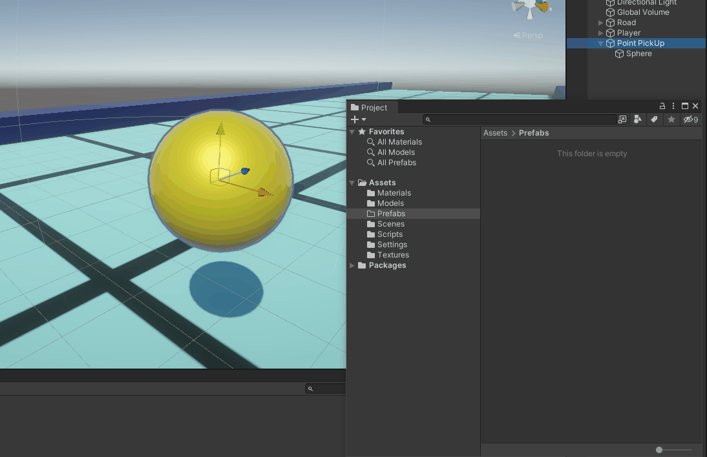

# Welcome to Rocket Runner!
*By Jake Rogers*

## Tutorial Video
For those who prefer videos to textual guides, this guide will eventually have an accompanying YouTube video to follow along!

## Chapter 0: Project Set-Up

We created a project for this game in [one of the previous steps in the series](./unity-first-step-new-proj.md), but we still have some housekeeping to take care of now that we have dropped into the editor.

1. Download and import the project assets.
2. Enable the Unity Input System.

### 1) Import the Project Assets
We actually do not need many external assets here, but I have created a few so that we have something nicer to look at than some primitives.

[Download the Assets Here](https://www.mediafire.com/file/j0z39166faq7ezl/rocket-runner-assets.zip/file)

Inside the zip file you downloaded, there is a *Models* and *Textures* folder which you will need to move into your project's asset folder. You can do this by using your operating system's file browser, or by just dragging and dropping them into Unity's Project window.


#### What the Heck is this Stuff?
The `Models` folder contains an FBX (3D model file) *Octahedron* I made, which is a useful shape for indicating direction. We will use it for both our player and our missile objects.

The `Textures` folder contains a 128x128 grid texture which we will use for the ground, as it would be difficult to perceive movement against a ground with no texture. You may want to hang onto this texture, since it is a useful placeholder to have on hand in other projects.

### 2) Enable the Unity Input System
By default, Unity projects come loaded with what is called the Legacy Input Manager, a system which Unity used to use to allow reading player input into game scripts.

While it is still a fully servicable way to capture player input (and in many ways, easier to initially set up), 2019 brought forward the 1.0 release of the new *Input System* package. The Input System offers a significantly more sophistocated design for managing player input across multiple devices, processing player input, reading input events, and much more than can be explained here.

The new Input System should be considered the 'canonical' way of capturing player input. Even though it is a bit tougher to learn, the greater degree of control will be of great use when you expand into bigger projects!

#### Install the Input System Package
You can (and should) install the Input System package using the editor itself. Along the top, use the dropdown windows to select `Window > Package Manager`

From there, switch the Packages displayed from `Packages: In Project` to `Packages: Unity Registry` to see packages available for download. Scroll down to the Input System, select it, and install.

Once installation is complete, a dialog box will pop up informing you that Unity needs to be rebooted to enable the Input System backend, which you should do.

NOTE: Once rebooted, you can return to the package to download some Input System sample scenes, which can be useful for figuring out how to work with it in future projects. You do not have to do that for this guide.

## Chapter 1: Scene Groundwork
Our game's environment will be a long road (going in the positive Z-axis direction) with two walls to keep the player in. That is easy enough to accomplish with a plane and two cubes!

We will also construct our player in this stage as well.

1. Create the Road
2. Create the Player
3. Apply Materials

### 1) Create the Road

In the Hierarchy Window, right-click on any empty space and create a plane (`3D Object > Plane`) and **one** cube (`3D Object > Cube`).

Select the two objects and reset their positions to `(0, 0, 0)` if they aren't already.

To make our road, we will resize the plane by setting its scale to `(1.5, 1.0, 10)`. This will make our road a bit wider and much longer in the Z-Axis. Rename the Plane to *Ground*.

We want to create 'railings' along our road which will stop the player from going off of it- our cube will serve this purpose. Resize it to be the same length as the ground by setting its Z scale to 100*. Also make the cube wider by changing its X scale to 2.

\* Note that the Plane primitive actually has a default size of 10 meters by 10 meters, and scaling it by 10 in the Z-Axis stretches it to 100 meters. This is why the cube must be resized to 100 and not 10, because the Cube is unitary (One meter cubed).

We will need to move the cube to block the edges of the plane, so change its position to be `(8.5, 0.5, 0)`. Rename the cube to *Right Wall*

We also, of course, need a left wall. Make life easier for yourself by duplicating the right wall! Select the Right Wall and press `Ctrl+D` to duplicate the GameObject. Then, change the new wall's X Position to `-8.5`, and rename it to *Left Wall*.

#### Grouping
These three GameObjects make up our road. Since we realistically always want them to keep their positions and scales relative to eachother, we should 'group' them together by making them siblings of one GameObject.

Right-Click on the Hierarchy and select `Create Empty`, and rename the newly created GameObject to *Road* (Be sure to set its location to (0,0,0) if necessary) Select the *Ground, Right Wall, and Left Wall* and drag-and-drop them on top of the *Road* to make them children of that GameObject.


Now, if you select the *Road* object and move it, you will see all of its children move together with it! The Hierarchy also allows you to fold away children, which helps de-clutter the Hierarchy.

In fact, let's move the road forward on the Z-Axis by 45, since we want the start of the road to be near the origin point.


### 2) Create the Player

Let's get started on our player. As a reminder, they will be a small Octohedron floating a bit off the ground, traveling forward in the Z-Axis.

#### Player Model

Start by creating an empty GameObject at the scene origin (0, 0, 0) and name it *Player*. Then, create a new empty GameObject as a child of the Player called *Player GFX* (Player Graphics).

In your Project window, navigate to the Models folder and drag-and-drop the *Octohedron.fbx* file onto the Player GFX object. You should see a rather large model appear. Select the newly created Octohedron model and scale it down to a more reasonable size, like `(0.4, 0.4, 0.4)`.

As mentioned previously, we want the player to look like they are floating, select *Player GFX* and move its Y Position up. `1.2` is a good number.


#### :octicons-question-16: Why Are we Doing it This Way?
You may be wondering why we have chosen to structure our player this way. Why not just use the Octohedron as our player root, for example? There is no immediate reason why you cannot do this, but it will bite you in the future.

For starters, many complex GameObjects will often need to consist of multiple GameObjects rooted under the same parent (similar to the *Road* we made earlier). Since children inherit their parent's Transforms (positions, rotations, and scales), we want to try and separate the hierarchy of unrelated items in our object as best as possible.

For example, later we will make our Octohedron model spin as it flies through the level. If we had everything parented to our Octohedron model, it would make **everything** on the player spin, which would be a huge mess!

Therefore, we create a GameObject specifically for the player's graphical representation, and put the Octohedron under that. By then moving the GFX up a bit, we move the model up as well. That way, any other graphical objects we have will all be vertically aligned, and our Octohedron can spin without any side effects.

Further, the position of the top-most GameObject in any object is often considered that collective object's 'True Position'. It is also often a useful notion to have an object's position be somewhere along the ground below its center of mass.

Our player is represented by a the Octohedron, but we would like its position to be described as somewhere along the X-Z plane, and the Y position is always 0 for simplicity's sake. So we keep the root GameObject at Y=0, but move the graphical representation of the player up a bit.

The benefits of this are a bit too difficult to explain out of context, but it will make more sense as we develop our player object (and as you make some inevitable mistakes in your own projects!). The way your organize and object's sub-hierarchy is very important when you start creating more complex things!

### 3) Apply Materials

Just like we did in the editor introduction, we will add some color to our scene by creating and applying some materials.

#### Add some color

Since this is already explained in [Introduction to the Editor](../../../articles/unity-articles/unity-editor-introduction.md#add-some-color), we will be brief here.

Create a `Materials` folder and add three materials, *Ground*, *Wall*, and *Player* and apply them to their respective objects by drag-and-dropping in the Scene window. I personally used a light-cyan for the ground, a dark blue for the walls, and a magenta for the player.

#### Grid Texture

Ah, but I mentioned we had a texture for the ground, let's add this now! Textures need to be added to 3D objects through materials, so select your *Ground* material. On its Base Map property which you used to change its color, click on the selector button (a circle with a dot in the middle) and search for then pick the `Grid-sprite` texture.

The result that you get from doing this is... Not quite right. The texture is there, but it is stretched across the entire road! We were hoping to get a repeating 'tiled' texture.

This is easy to fix. Lower down in the material properties, change the Tiling settings to `X: 3, Y: 20`. This basically tells the shader that it should make the texture 3 times smaller in the X direction, 20 times smaller in the Y, and then repeat the texture to compensate. This resizes the texture to be 1:1 in scale tiled across the plane.

The numbers 3 and 20 are picked because the scale of our plane is `(1.5, 1, 10)`- we use the scale numbers then multiply by two to account for the length in both directions (Z translates to Y when it comes to the texture).

Your scene should look something similar to the following:


## Chapter 2: Player Locomotion
We are ready to get our player moving! As previously mentioned, our player should constantly move forward down the road (positive Z)- they will have no control over that. They, however, will also be able to **strafe left and right to control their position on the road** (X axis), which will involve player input.

Additionally, we want our player to collide with the walls of the road so they cannot escape, and we will need to come up with some solution to have our camera follow the player as they sail off into the distance.

1. Set Up Physics for the Player
2. Moving Forwards
3. Bring the Camera With!
4. Player Actions
5. Strafing

### 1) Set Up Physics For the Player
As mentioned above, we need our player to collide with various objects throughout the scene to keep them in the playable space and for other purposes later. Of course, collision detection in 3D space is not a trivial matter, so we will use Unity's Physics to handle detection for us.

However, the *movement* of our player is not going to be physically simulated- in fact, we want the player to have tight control over their character, so we will be foregoing drag simulations, inertia, mass, etc., we **only** want collision.

#### Rigidbody Component
Select the *Player* GameObject and, using the Inspector, do `Add Component > Rigidbody` by using the button at the bottom of the Inspector. Rigidbodies also need a collider component *somewhere* on the same GameObject or a GameObject in its children.

#### Add a Collider
Colliders dictate the physical space an object takes up within the Physics system, and are used for detecting collisions. Question is, which GameObject should we put our collider on?

The obvious answer is on the Octohedron model. After all, the player's collision ought to most closely resemble the player's graphical representation, right? That is reasonable, but in the future, we may want our player's model to rotate or move up and down for special effects, and **we don't want to be radically changing the player's collision boundaries when we do that**.

Imagine if our player was trying to navigate a very narrow corridor, and all of a sudden one of our graphical effects caused the Octohedron to spin sideways, **which then collided them with a wall and forced them to fail**.

No, we want to have collision without locking ourselves out of being able transform the player model. Realistically, we only want to designate an abstract space *in the middle* of the player which is used for collision detection- a 'hitbox' so to speak. **Therefore, let's attach our collider to the *Player* root object**. That way, we don't have to worry about any changes to our graphics objects affecting our collisions.

Theory aside, select the *Player* and do `Add Component > Box Collider` from the Inspector. You should now see a green box in the scene for the player. Using the settings on the Box Collider component, we can adjust its size and center to vaguely wrap it around the Octohedron's normal position. The 'Edit Collider' toggle button allows you to use Gizmos to adjust it in the Scene view, which is highly recommended.

Position and size your box collider to the approximate size of the Octohedron, and drag the bottom side down a bit so it can collide with the walls better.

**Protip: make the X & Z size of the collider slightly *smaller* than the actual Octohedron**. As it turns out, your game will often feel better if the player's collision is a tad smaller than it seems it should be. Perfectly accurate colliders make it feel like you are "getting caught" on things all the time, and smaller colliders let players feel like they are narrowly dodging around things all the time.


Here is what my collider looks like. Notice it extends a bit lower so we can get good contact with the walls, and it doesn't fuller enclose the actual model. You can copy my `Center` and `Size` settings if you are having difficulty getting yours right.

#### Rigidbody Configuration

Returning back to the Rigidbody component, our player now has physics. In fact, if you were to raise it a bit higher up and enter play mode, you would see it fall to the ground. 

We need to make a few changes to prevent the physics system from making unwanted displacements on our *Player*:

1. Change the `Mass` to some large number, like `999999`. This will allow our *Player* to push dynamic physics objects out of its way if necessary.
2. Disable `Use Gravity`. We do not desire any downwards velocity right now.
3. Change the `Collision Detection` mode from `Discrete` to `Continuous Speculative`. This gives our rigidbody a more reliable high-speed collision detection solution at a minor increase to computation. It should eliminate the possibility of tunneling through obstacles at high speed.
4. Fold out the `Constraints` property and freeze the Y position and all rotation axes. Again, our game does not make use of the vertical Y-Axis for now, so we will just lock that position. We also don't want our *Player* to start spinning from any applied forces.

### 2) Moving Forwards
It is not too difficult to get our player moving constantly forward, but we will need to use a script to drive this motion!

In your Project window, create a new folder `Scripts`. In that folder, Right-click for `Create > C# Script`. Name the script `PlayerMovement`.

```cs title="PlayerMovement.cs" linenums="1"
using UnityEngine;

[RequireComponent(typeof(PlayerMovement))]
public class PlayerMovement : MonoBehaviour
{
    private Rigidbody _rigidbody;

    private void Awake()
    {
        _rigidbody = GetComponent<Rigidbody>();
    }

    private void FixedUpdate()
    {
        Vector3 newPosition = _rigidbody.position;   // Get the current position...
        newPosition += Vector3.forward;             // Add (0, 0, 1) to the newPosition in order to move it forward.

        _rigidbody.MovePosition(newPosition);
    }
}
```

This script is pretty simple. In the Awake method (called when the object is first loaded in, but before any update calls), we get a reference to the rigidbody component attached to the same GameObject as the script- the one for our player.


In the FixedUpdate call, which occurs whenever a physics update occurs, we will take our current position, increment it by one in the z-axis, and move our rigidbody to the incremented position. Note that for the most part, any logic which involves calls or accesses to rigidbody components should always occur within the FixedUpdate call so that it can properly interact with other physics objects!

**Did you notice the `RequireComponent` attribute** above the class definition? When you specify required components on a MonoBehavior class, it tells Unity that your script should **always** be paired with a component of that type when attached to a GameObject. This prevents our call on line 10 from ever returning null and crashing our script.

Save the script. Back in the editor, select the *Player* and `Add Component > PlayerMovement`, then enter Play Mode, you will notice your player zoom off!

### 3) Bring the Camera With!
Obviously, we want to have our camera keep place with the player!

#### A Bad Solution
An easy but bad way to accomplish this would be to just make the *Main Camera* a child of the *Player* GameObject, then offset it to a nice angle. However, this has two rather cumbersome side effects:

1. Parenting cameras directly to physics objects is janky. While it may or may not manifest itself here, it is possible to get some strange, jitter-type artifacts when you do this, so it is generally not great to have the camera be moving in association with the FixedUpdate loop.
2. This makes the *Player* 'responsible' for the *Main Camera*. From a design sense, we would like to [decouple things as much as possible](https://en.wikipedia.org/wiki/Single-responsibility_principle). In a practical sense, it means our player will need to constantly compensate for the camera. For example, if we delete the *Player* GameObject, we will need to detach the camera first or else our game will plunge into darkness with it (this is bad).

#### A Good Solution (Follow Script)
A better solution is to allow the camera to handle its own movement by feeding it an object to follow. This not only allows us to follow the player with low coupling, it also gives us some wiggle room to potentially have the camera look at other targets.

Essentially, we shall create a Script to move the camera around as though it were being held by an extremely diligent camera operator.

Create a new script, name it `CameraRig`

```cs title="CameraRig.cs" linenums="1"
using UnityEngine;

public class CameraRig : MonoBehaviour
{
    public Transform FollowTarget;      // The transform this camera will follow
    [SerializeField] private Vector3 _followOffset = Vector3.zero;  // The local position that FollowTarget is followed from.
    [SerializeField] private bool _useAwakeOffset = true;   // Should the _followOffset be determined by my global position on awake?

    private void Awake()
    {
        if (_useAwakeOffset)
        {
            _followOffset = transform.position;
        }
    }

    private void LateUpdate()
    {
        if (FollowTarget != null)
            transform.position = FollowTarget.position + _followOffset;
    }
}
```

Again, fairly simple. Note that the `SerializeField` attribute is being used to allow private-scoped variables to show up in the inspector- a useful trick if you want to populate script parameters without exposing their scope.

The option to set our `_followOffset` in the awake method is nice, since it lets us use the Scene view to pick a nice camera angle.

Note that we use the **`LateUpdate`** method to change our camera's position. The `LateUpdate` tick always occurs after that of `Update` and `FixedUpdate` (If one occurs that frame), but just before the frame is written to the screen. This makes it a good time to reposition our camera so it has the most up-to-date position.

If you changed the position of the camera in the regular `Update` tick, it is possible that something else could change the Player's position before the screen write, which would result is small inaccuracies. Small inaccuracies on the **player's camera** produce very ugly jitter, so try to avoid them.

#### Apply the New Script
We will not actually apply this script directly to the camera. Instead, we will create a *Camera Rig* object, put the script on it, then make the *Main Camera* a child of that. You can do this easily by right-clicking the *Main Camera* and picking `Create Empty Parent`, then add the new script to the object.

Ensure that our `Use Awake Offset` flag is on, and position the Camera Rig at a nice position to view the Player and the upcoming road. You will want to rotate the camera on the X-axis a bit to get a downward view- it is probably better to apply that rotation to the *Main Camera* itself.


I put my *Camera Rig* at `(0, 10, -12)` and set the X-axis rotaton of the *Main Camera* to 23 degrees. I also changed the FOV of the *Main Camera* to 52 degrees to get a nice view.

### 4) Player Actions
We need to improve our `PlayerMovement` script to allow the player to strafe left and right. Before that, we must create an Input Actions asset- a map of accepted Player Inputs to action events which we can hook our scripts into.

If you wanted to create a new Input Actions asset (we do not), one can be created in the Project window by doing `Create > Input Actions`.

Instead, we can actually trick Unity into giving us a pretty competent default. On your *Player* object, add a `Player Input` component. You will see a small message box in the Player Input component informing you that no Input Actions exist, select "Create Actions...". The default name is fine here.

Input Actions asset was created in your `Assets` directory. Double-click it in the Project window to pull it open. You will see it has created two *Action Maps* (different controls for different contexts), select the *Player* one.

By default we were given some Actions for Moving, Looking, and Firing, of which we will only use one (There is little harm in keeping the others, hang onto them in case you wish to expand this project in the future). Expand out the *Move* Action.


Each Action (green) is composed of a Binding (blue), which may be composited (purple) from a few inputs. Giving an action multiple bindings is great for allowing the same action to be expressed by more than one input device. By default, our *Move* action can be inputted via the Keyboard WASD or arrow keys, a gamepad stick, a **VR controller**, and even a joystick!

We could definitely spend much longer than necessary here detailing the Input System. For now, select the *WASD* binding and change its Mode from `Digital Normalized` to `Digital`. Since we only plan on using the horizontal axis of the Move input vector, we do not care about normalizing the value. **Be sure to hit the `Save Asset` button**- it will not auto save for you.

Make some time to read some dedicated articles about the Unity Input System. It has a learning curve, but it is very powerful, and you will make some progress after some frustrating trial and error.

Recommended Reading: [Game Dev Beginner's "Input In Unity Made Easy"](https://gamedevbeginner.com/input-in-unity-made-easy-complete-guide-to-the-new-system/)

If you created the Input Action asset via the Player Input component as we did, the component's `Actions` parameter should already be populated. If not, select the one we just made now.

### 5) Strafing
Now that we prepped our user input, we can upgrade our `PlayerMovement` script to allow the player to move left and right.

#### Strafe Movement

Simply enough, when we are in the process of calculating the next position of our player on any given frame, we should also add an offset on the X axis.

```cs title="PlayerMovement.cs" linenums="1" hl_lines="2 17 18 19 21 24 25 26 27"
using UnityEngine;
using UnityEngine.InputSystem;

public class PlayerMovement : MonoBehaviour
{
    private Rigidbody _rigidbody;

    private float _strafeInput = 0f;

    private void Awake()
    {
        _rigidbody = GetComponent<Rigidbody>();
    }

    private void FixedUpdate()
    {
        Vector3 positionOffset = Vector3.zero;
        positionOffset += Vector3.forward;             // Add (0, 0, 1) to the newPosition in order to move it forward.
        positionOffset.x += _strafeInput;              // Add player's horizontal input to X. 1 if right, -1 if left.

        _rigidbody.MovePosition(_rigidbody.position + positionOffset);
    }

    private void OnMove(InputValue inputValue)
    {
        _strafeInput = inputValue.Get<Vector2>().x;
    }
}
```

Whenever the *PlayerInput* component on our *Player* GameObject sees receives an event from the player performing an input, it will broadcast a message to any script on its GameObject. By giving our `PlayerMovement` script a method for `void OnMove(InputValue)`, we can tell our script to react to the player updating their movement inputs.

In this circumstance, we just want to read in the value of the player's horizontal input to a stored variable. Note that we need to add `using UnityEngine.InputSystem` for the `InputValue` object.

We also slightly change the way that we calculate the new position. Instead, we compute an *offset* which is then added to the rigidbody's position in the `MovePosition` call. This will be a better-expressed approach for when we add speed control.

`_strafeInput`, then, will be equal to -1 if the player inputs left, 1 if right, and 0 when nothing is held. From there, we add their input to the `newPosition.x` in order to apply some horizontal velocity for each frame!

#### Speed Adjustment
Let's consider for a second- how *actually* fast is our player moving? Well, all of our logic for moving the player forward is being incremented in the `FixedUpdate` method. As the name suggests, this method is called at very exact, fixed intervals: exactly every 0.02 seconds by default, or 50 times a second. 

This means that our player has a forward speed of 50 units (meters) per second. This is very awkward, since it is way too fast and we would have to use small multipliers to slow it down.

To account for this, we should multiply our per-update offset to be one-unit per second, which we can do by just multiplying the whole thing by that fixed update interval, which Unity happens to keep in a variable at `Time.fixedDeltaTime`.

```cs title="PlayerMovement.cs (frag)" linenums="15" hl_lines="7"
private void FixedUpdate()
    {
        Vector3 positionOffset = Vector3.zero;
        positionOffset += Vector3.forward;             // Add (0, 0, 1) to the newPosition in order to move it forward.
        positionOffset.x += _strafeInput;              // Add player's horizontal input to X. 1 if right, -1 if left.

        positionOffset *= Time.fixedDeltaTime;

        _rigidbody.MovePosition(_rigidbody.position + positionOffset);
    }
```

After making this change, you will notice that your player now moves at exactly one meter per second forward- very slow, but it gives us a good platform to multiply by integers and get a predictable speed.

#### Variable Speed
By using some `[SerializeField]`-tagged fields, we can apply some multipliers to the forward and horizontal contributions to our `positionOffsets` and produce different speeds.

```cs title="PlayerMovement.cs (frag)" hl_lines="4 5 13 14"
...
public class PlayerMovement : MonoBehaviour
{
    [SerializeField] private float _forwardSpeed = 16f;
    [SerializeField] private float _strafeSpeed = 10f;

    private Rigidbody _rigidbody;
...

    private void FixedUpdate()
    {
        Vector3 positionOffset = Vector3.zero;
        positionOffset += Vector3.forward * _forwardSpeed;             // Add (0, 0, 1) to the newPosition in order to move it forward.
        positionOffset.x += _strafeInput * _strafeSpeed;              // Add player's horizontal input to X. 1 if right, -1 if left.

        //positionOffset *= Time.fixedDeltaTime;

        _rigidbody.MovePosition(_rigidbody.position + positionOffset);
    }
...
```

In the Inspector, you should now be able to modify the `_forwardSpeed` and `_strafeSpeed` to get different respective speeds!

Since we did the groundwork of multiplying it against a unit-per-second speed, the resultant speed will be in X-meters-per-second. We **ALSO** know that a single segment of our road is 100 meters long, so each road segment will provide 100/X seconds of gameplay. Knowing how long it takes for a player to traverse your levels is useful to keep in mind when designing your game's content. Pretty neat!

## Chapter 3: Points
In our game, the player will need to collect points which, in turn, will give them missiles. In order to destroy *Kill Walls* which occasionally show up with increasing levels of hitpoints, they will need to have collected enough points or else they will run into the wall and lose.

So, in this chapter we will create some pickups which will eventually spawn missiles for the player to hang onto for the next chapters!

1. Create *Point Pickup* Objects
2. PointPickUp.cs Script
3. Spruce Up the Pick Ups

### 1) Create Point Pickup Objects
This will be a pretty simple GameObject, we will use a sphere to represent the PickUp, and a large trigger collider to describe how close the *Player* must be to collect it.

In your Hierarchy, create a new empty GameObject and name it *Point PickUp*. Then, create a Sphere object as a child of it.

On that Sphere child, remove it's Sphere Collider, we will be making one on the parent object.

On the *Point PickUp* GameObject, `Add Component > Sphere Collider`. This Sphere Collider will be the volume the *Player* must enter in order to collect the PickUp.

On the collider, enable the `Is Trigger` property. This will stop the collider from registering collections on rigidbodies, but still allow it to *detect collisions* that we can hook into from our scripts.

We will also make this trigger larger than the Pick Up's visual representation so that the player doesn't need to precisely collide with it. I changed the radius to `3.5`.


Position the pick up somewhere along and above your road- I put mine at a height of `Y = 2`. Also, make a material for this pick up to give it some color! I chose to make mine yellow with a tiny bit of metallic `Metallic Map = 0.37`.

### 2) PointPickUp.cs Script
This is going to sound strange, but before we work on this script, we need to at least create the `PlayerMissiles.cs` script and put it on our *Player*, it will make sense in a moment.

Just like before, create a new script called `PlayerMissiles.cs`, as well as `PointPickUp.cs`. On the *Player* GameObject, `Add Component > PlayerMissiles`. We will code this script later.

#### Scripting
On the *Point PickUp* GameObject, `Add Component > PointPickUp` and open it for editting.

This script will be set up to watch for any GameObject with **specifically a PlayerMissile** component to enter its trigger boundary. When that occurs, the PickUp will tell said PlayerMissile script to increment its points by one, then the PickUp should disappear.

```cs title="PointPickUp.cs" linenums="1"
using UnityEngine;

public class PointPickUp : MonoBehaviour
{
    [SerializeField] private int _pointValue = 1;

    private void CollectPoint(PlayerMissiles playerMissiles)
    {
        Debug.Log("I have been collected!");
        // TODO: Add a point to playerMissiles.
    }

    private void OnTriggerEnter(Collider other)
    {
        // Try to find PlayerMissiles Component on entering GO.
        PlayerMissiles playerCheck = other.GetComponent<PlayerMissiles>();

        // If component was found...
        if (playerCheck != null)
        {
            CollectPoint(playerCheck);  // Collect the point.
        }
    }
}
```

The `OnTriggerEnter` method is called during the `FixedUpdate` call when something enters the trigger collider *on the same GameObject* as the script. The `Collider other` is a reference to the collider component which invoked the collision.

From the collider, we can query its GameObject for other components by using `GetComponent<type>`, so we check to see if the incoming object has a `PlayerMissiles` component, and run a routine for collecting the point if it does.

It is very important that we verify the incoming collision *does actually contain* a `PlayerMissiles` component. `GetComponent` can return `NULL` if no component of the specified type is found on `other`, which would then trigger a `NullReferenceException` if we tried to invoke methods on it! Remember that *any* GameObject with a collider on it could invoke the `OnTriggerEnter` method by simply moving into its bounds- we want to filter to only those with `PlayerMissiles` scripts (one, in our case- the Player!).

Since our `PlayerMissiles` script does not yet have a method for receiving points, we will write ourselves a note to implement that later.

#### Prefabs
We are going to want to have multiple copies of these pick-ups, but we want them to all generally operate the same way with similar parameters. This makes them a good candidate to turn into a **prefab**.

Prefabs are GameObjects which are saved somewhere in your Assets folder. Copies of the prefab can be instantiated into the scene which will inherit all of the properties and structure of the prefab. Additionally, if you make any changes to a prefab, **all of the instances of that prefab in any scene are updated to match**. This obviously makes them very powerful for reuse.

In your Project window, `Create > Folder`, name the folder *Prefabs*, and open it. Then, drag-and-drop the *Point PickUp* GameObject from the hierarchy into the empty space in the *Prefabs* folder. You should then see the new Prefab appear in the Project window and the *Point PickUp* GameObject in the Hierarchy should turn blue to indicate it is an **instance of a prefab**.



Now, try creating some new instances by drag-and-dropping from the Project window or `Ctrl+D` on the existing instance, and arrange the pick ups in a line.

***IMPORTANT***: When you want to make a change to a prefab that effects **all** instances, you should double-click it in the Project window to open the prefab editor. This will properly propagate all changes to any instances.

### 3) Spruce Up the Pick Ups
Now normally, it is not a great idea to invest a bunch of time polishing individual game elements when you are still prototyping. We could, for instance, decide later that we do not actually want to have these pick ups, and then all that effort would go down the drain. Or worse: we could become too attached to something because we have spent too much time refining it and be resistant to changing it out for something better.

However, it doesn't hurt to add a bit of refinement to something you know you want to keep, and I personally find it to be a good break from prototyping that keeps me invested in the project.

#### Move To Player Effect

Instead of the PickUp objects simply disappearing from thin air when we collect them, we will have them fly into the player and be collected when they reach them.

```cs title="PointPickUp.cs" linenums="1" hl_lines="4 5 7 9 11-28 34 45"
public class PointPickUp : MonoBehaviour
{
    [SerializeField] private int _pointValue = 1;
    [SerializeField] private float _flyAcceleration = 32f;
    [SerializeField] private float _flyCollectionDistance = 0.5f;

    private float _flySpeed = 0f;

    private PlayerMissiles _targetPlayerMissiles;

    private void Update()
    {
        if (_targetPlayerMissiles != null)
        {
            _flySpeed += _flyAcceleration * Time.deltaTime;
            
            transform.position = Vector3.MoveTowards(
                transform.position,
                _targetPlayerMissiles.transform.position,
                _flySpeed * Time.deltaTime
            );

            if (Vector3.Distance(transform.position, _targetPlayerMissiles.transform.position) <= _flyCollectionDistance)
            {
                CollectPoint();
            }
        }
    }

    private void CollectPoint()
    {
        Debug.Log("I have been collected!");
        // TODO: Add a point to playerMissiles.
        Destroy(gameObject);
    }

    private void OnTriggerEnter(Collider other)
    {
        // Try to find PlayerMissiles Component on entering GO.
        PlayerMissiles playerCheck = other.GetComponent<PlayerMissiles>();

        // If component was found...
        if (playerCheck != null)
        {
            _targetPlayerMissiles = playerCheck;
        }
    }
}
```

When the `PlayerMissiles` component is detected, we keep track of it in a class member. Whenever that class member `_targetPlayerMissiles` is not null, we will move the position of the pick up closer to the player's position by an accelerating velocity per frame. Lastly, when the distances are lower than some set distance, we then trigger the collection.

Note that we multiply the acceleration and the velocity by `Time.deltaTime`. This number is equal to the number of seconds between the last frame and this frame, which has the effect of converting the accleration / velocity to a per-second quantity instead of a per-frame quantity.

Note that increasing the velocity each frame gives our pick up some more character by introducing a *ramp up* to the collection. It also guarantees that the pick up will eventually catch up to the *Player* even if they are initially faster.

Go in Play Mode and give it a try! You can tweak the `_flyAcceleration` to get some different results. You may want to push back or increase the FOV on your camera to be able to observe the movement better.

#### Slow Turn Effect

Right now, the pick up always moves in a straight line from its position to the *Player*. We can add even more character to the flight by making the velocity direction slowly correct itself over time, which will give the movement a more circular arc than a J-shaped one.

To do this, we will first determine the initial direction that the pick up must travel to get to the *Player*. Since our *Player* is traveling forward at a considerable speed, that initial direction will become incorrect pretty quickly, and the pick up will likely miss the player.

As time goes along, we will gradually correct the velocity direction towards the actual direction from the pick up to the *Player*, which will cause it to smoothly hook around and eventually reach the player.


```cs title="PointPickUp.cs" linenums="1" hl_lines="8 10 22 25 26 29-32 35 38 61"
using UnityEngine;

public class PointPickUp : MonoBehaviour
{
    [SerializeField] private int _pointValue = 1;
    [SerializeField] private float _flyAcceleration = 32f;
    [SerializeField] private float _flyCollectionDistance = 0.5f;
    [SerializeField] private float _flyDirectionCorrection = 2f;

    private Vector3 _velocityDirection = Vector2.zero;
    private float _flySpeed = 0f;

    private PlayerMissiles _targetPlayerMissiles;

    private void Update()
    {
        if (_targetPlayerMissiles != null)
        {
            // Accelerate the speed
            _flySpeed += _flyAcceleration * Time.deltaTime;

            Vector3 targetPosition = _targetPlayerMissiles.transform.position;

            // Incrementally correct the current velocity towards the correct one
            Vector3 correctDirection = Vector3.Normalize(targetPosition - transform.position);
            _velocityDirection = Vector3.MoveTowards(_velocityDirection, correctDirection, _flyDirectionCorrection * Time.deltaTime);

            // If the position is negative, flip the y velocity positive to keep it positive.
            if (transform.position.y <= 0f)
            {
                _velocityDirection.y = Mathf.Abs(_velocityDirection.y);
            }

            // Move the transform along the velocity direction at _flySpeed speed.
            transform.Translate(_velocityDirection * _flySpeed * Time.deltaTime);

            // Check the distance, collect if close enough.
            if (Vector3.Distance(transform.position, targetPosition) <= _flyCollectionDistance)
            {
                CollectPoint();
            }
        }
    }

    private void CollectPoint()
    {
        Debug.Log("I have been collected!");
        // TODO: Add a point to playerMissiles.
        Destroy(gameObject);
    }

    private void OnTriggerEnter(Collider other)
    {
        // Try to find PlayerMissiles Component on entering GO.
        PlayerMissiles playerCheck = other.GetComponent<PlayerMissiles>();

        // If component was found...
        if (playerCheck != null)
        {
            _targetPlayerMissiles = playerCheck;
            _velocityDirection = Vector3.Normalize(playerCheck.transform.position - transform.position);
        }
    }
}
```

If you subtract a vector `position` from the vector `target`, the result will be a vector which would move `position` to `target`. If you then *normalize* that vector, you will get the **direction** from `position` to `target`. Commit this to memory, it is a very important technique!

When the trigger initially occurs, we will store the initial direction in `_velocityDirection`.

Then, per-update, we will slowly move that initial direction towards the correct direction needed to intercept the *Player* as it moves along. All the while, we move the pick up along the ever-correcting direction vector by the accelerating speed.

Additionally, since our player's position is at y=0 and our points are above the ground, our pick-up may try to go below the ground. If it does, we will fix this issue by simply making the y component of our `_velocityDirection` positive. This also gives us an interesting *bounce* effect.

Do not worry if this is a bit advanced for you right now. As long as the you get the general idea, you will learn how to manipulate vectors with practice.

As you will come to find out, the effort required to make something look *good* is often a bigger ordeal than just making the thing in the first place! This is why it is a good idea to typically save refinement for later stages so your effort is not wasted!

## Chapter 4: Missiles
If you go back to the [short preview shown in this series' introduction](unity-first-step-index.md#rocket-runner), you can see that when the player collects the pick ups, small missiles appear spinning around them.

To accomplish this we will create a new script which will handle collecting points, spawning missiles, and positioning them around the player. We will also need to create those missile prefab objects, which will contain a basic script that will be evolved in the next chapter.

1. Missile Prefab
2. Point Collection Response
3. Missile List
4. Easy Visual Improvements

### 1) Missile Prefab

In order to instantiate a GameObject at runtime from a script, we (generally) need to save that object ahead of time as a prefab. So let's go ahead and make our missile objects now.

Create an empty GameObject called *Missile*, and attach the Octohedron model to it as a child just like we did for the *Player* (though we do not necessarily need to make a *... GFX* object this time). Create a new material to color it.

For now, we will also create a `Missile.cs` script that will be attached to our *Missile* object, though it will not do anything currently. We will need the class to exist since our script which we will use to manage the player's missiles will need to maintain a list of `Missile` objects.

Create a new `Missile.cs` script, and add it to the *Missile* object as we have done before. Then, save the missile in your *Prefabs* folder! You can then delete the *missile* object from the Hierarchy.


### 2) Point Collection Response (PlayerMissiles.cs)

Whenever we want to construct some kind of behavior which manages a collection of objects for some specified task, it is almost always a good idea to create a script which decouples the behavior of managing the group from managing the individuals. In this scenario, we need a script to operate individual missiles (`Missiles.cs`), and then a script to handle collecting, spawning, and choosing which missiles to fire- essentially a manager.

We will modify our placeholder `PlayerMissiles` script for this purpose. It will be a component of the *Player* GameObject and will be responsible for handling the tasks mentioned above. The first thing we need it to do is let our pick up objects send a message to the script when they are collected.

```cs title="PlayerMissiles.cs" linenums="1"
using System.Collections;
using System.Collections.Generic;
using UnityEngine;

public class PlayerMissiles : MonoBehaviour
{
    private int _missilePoints = 0;

    public void AddPoint(int points)
    {
        _missilePoints += Mathf.Max(0, points);
        Debug.Log(_missilePoints);
    }
}
```
```cs title="PointPickUp.cs (frag)" linenums="45" hl_lines="3"
    private void CollectPoint()
    {
        _targetPlayerMissiles.AddPoint(_pointValue);
        Destroy(gameObject);
    }
```

Since our pick up script already stores a reference to the `PlayerMissiles` class it is chasing, adding points to the class is as easy as providing a public method for it to do so. We also use `Mathf.Max` to ensure the points added is at least 0.

I have not mentioned this yet, but we allowed each pick up to have it's point total be a property changeable in the Inspector. This allows us to make pick ups which are worth more points. Lets go ahead and make a pick up which is worth **three** points.

Select one of your pick ups in your scene, `Ctrl+D` to duplicate it, move it, and change its `Point Value` property to `3`. Also create and apply a new material to color it differently.

Now, drag it down to your Prefabs folder again and you will get a new prompt, asking if you would like to make this an *original prefab* or a *variant*. A variant prefab functions similarly to *class inheritance*, it defines the variant as a **subtype** of a base prefab by providing a few overrides that make it distinct. The variant option makes perfect sense here, so use that!

Optionally, you can also make it a tad bigger and lower it's flight speed / correction to give it a weightier feel as it flies toward the player.


### 3) Missile List

The number of points our player has will correspond to how many missiles they currently have ready at any given time. For now, we will just have one point correspond to one missile. This could be a problem in the future if we have hundreds of points (from both a visual and performance stand point), but it will be fine for now.

Our `PlayerMissiles` script will need to create missiles in order to sync up the missile count with their point count. Further, it will need to **keep track** of those existing missile objects so that they can be fired later when we eventually implement the kill walls, which we will do by keeping a list of them.

Before we do some scripting, we also need to designate GameObject in our hierarchy that we want to act as a parent to our spawned missiles, which will also dictate where they appear positionally.

To accomplish this, we shall create a new empty object under the *Player* called *Missile Store*, which we will move half way between the ground and the our *Player GFX* transform.

```cs title="PlayerMissiles.cs" linenums="1"
using System.Collections;
using System.Collections.Generic;
using UnityEngine;

public class PlayerMissiles : MonoBehaviour
{
    [SerializeField] private GameObject _missilePrefab;
    [SerializeField] private Transform _missileStore;
    [SerializeField] private float _missileSpawnRadius = 3f;

    private List<Missile> _missileList;
    private int _missilePoints = 0;

    public void AddPoint(int points)
    {
        _missilePoints += Mathf.Max(0, points);

        SyncMissilesToPoints();     // Create missiles to catch up with the points
    }

    private void Awake()
    {
        _missileList = new List<Missile>();
    }

    /// <summary>
    /// Creates more missiles to make the missile count equal to the number of missile points.
    /// </summary>
    private void SyncMissilesToPoints()
    {
        int missilesToCreate = _missilePoints - _missileList.Count;     // # of missiles needed to sync

        for (int i = 0; i < missilesToCreate; i++)
        {
            CreateMissile();
        }
    }

    /// <summary>
    /// Instantiates a missile, assigns a random offset to prevent stacking, and adds it to the list.
    /// </summary>
    private void CreateMissile()
    {
        // Creates a new instance of the prefab as a child of _missileStore
        GameObject missileGO = Instantiate(_missilePrefab, _missileStore);
        Missile missile = missileGO.GetComponent<Missile>();

        Vector3 randomOffset = new Vector3(
            Random.Range(-_missileSpawnRadius, _missileSpawnRadius),
            0f,
            Random.Range(-_missileSpawnRadius, _missileSpawnRadius)
        );

        missile.transform.localPosition = randomOffset;

        _missileList.Add(missile);
    }
}
```

This script gets pretty big, but that is because we are also trying to work some better structure here by using functions and some documentation.

First, we create a reference to our missile prefab and the transform we would like to place them under. These will both be populated using the Inspector. We will discuss `_missileSpawnRadius` in a second.

The `_missileList` is a collection of any active missiles we have spawned. Note that even though it is a collection of `Missile` objects, the objects have an implied GameObject attached to them since they are a *MonoBehavior*, and storing them as the `Missile` component keeps us from having to constantly use `GetComponent`.

The `CreateMissile` method uses the `Instantiate` method to create a new instance of our `_missilePrefab` as a child of `_missileStore`. We then also generate a random offset for its local position so that all of the missiles are not spawned right on top of each other (Note that the local position is where it lies relative to its parent, similar to when you change the position of children in the Hierarchy). The `Missile` object of the newly created instance is added to our list.

The `SyncMissilesToPoints` method will determine how many missiles need to make the count in the list one-to-one with the `_missilePoints`. It needs to be called whenever our point count is changed, so we make a call to it in `AddPoints`.

As a nice touch, we also introduce some C# XML documentation- something that is very worthwhile as your project grows and gets larger. You will want to be able to keep notes on what complex functions and scripts do. The XML documentation also adds intellisense information to anything you put it on- hover your mouse over `CreateMissile()` in your editor and you'll see!

[Learn more about C# XML documentation](https://www.oreilly.com/library/view/c-in-a/0596001819/ch04s10.html)

Test your game and you will see new missiles appearing as you collect points, nice!

### 4) Easy Visual Improvements
While we are at it, we will apply some script-driven animation to our missiles in order to give them a bit more life.

#### Store Rotation
By rotating our *Missile Store* we can create the effect of our missiles orbiting around the *Player* which looks pretty cool. It is also very simple to implement because of how our Player's hierarchy is organized.

```cs title="PlayerMissiles.cs (frag)" linenums="1"
...

[SerializeField] private float _storeSpinSpeed = 180f;

...

private void Update()
{
    _missileStore.Rotate(new Vector3(0f, _storeSpinSpeed * Time.deltaTime, 0f));
}
```

The Y-Axis rotation applied per frame gives us a Z-X plane rotation of the missile store, which gives us our orbiting motion. Multiplying the `_storeSpinSpeed` by `Time.deltaTime` turns it into a degrees-per-second speed instead of a degrees-per-frame speed.

Now, if you tried this in Play Mode, you likely noticed a small issue...


The rotation of the store also causes our missiles to point in the wrong direction! This is easy to fix, we will just have the missiles also correct their rotation to be forward-facing each frame inside of `Missile.cs`.

```cs title="Missile.cs" linenums="1"
using UnityEngine;

public class Missile : MonoBehaviour
{
    private void Update()
    {
        transform.rotation = Quaternion.LookRotation(Vector3.forward, Vector3.up);
    }
}
```

Each frame, set the **global** rotation of the missile to be a rotation which faces down the positive Z axis.

#### Missile Spin

We can also add a little more character by having our missiles spin on the Z-axis passively.

```cs title="Missile.cs" linenums="1" hl_lines="5 7 9-13 19 20"
using UnityEngine;

public class Missile : MonoBehaviour
{
    [SerializeField] private float _spinSpeed = 200f;

    private float _currentSpinAngle = 0f;

    private void Awake()
    {
        // Apply a random starting angle 
        _currentSpinAngle += Random.Range(0f, 359f);
    }

    private void Update()
    {
        transform.rotation = Quaternion.LookRotation(Vector3.forward, Vector3.up);  // Reset rotation

        _currentSpinAngle += _spinSpeed * Time.deltaTime;   // Increment the spin angle by time difference
        transform.Rotate(0f, 0f, _currentSpinAngle);        // Rotate to spin angle
    }
}
```

Note that the `Transform.Rotate(Vector3)` method typically applies a rotation *additive to* the existing one, but since our assignment on line 17 overrides the previous rotation, the spin needs to be stored in a variable.

We also so `Time.deltaTime` being used in a slightly different way here. If you increment a variable by `Time.deltaTime` each frame, that variable effectly acts as a stopwatch by accumulating the number of real-world seconds.

Lastly, we also apply a random starting angle to the missile so that missiles added in the same frame are generally not in phase with each other, which may looks weirdly artifical.

---

Previously, I mentioned that it is generally best not to work on visual refinement while prototyping, since we may wind up needing to scrap entire features later down the line. However, I frequently break this rule.

I personally find that occasionally making visual refinements keeps me invested in longer projects- having something nice to look at is very appealing and makes you feel like you are getting somewhere, which combats burn-out a bit. It also gives you something neat to show your friends, which very much helps with encouragement (if you have *good* friends that is!).

It is a fine line that you will have to set for yourself, but I generally find easy slam-dunks like what we just implemented to be worth the time every once in a while.

## Chapter 5: Kill Walls

Our primary obstacle, Kill Walls, will be the basis of our game's challenge. Kill Walls will have a specific amount of Hit Points (HP) that need to be defeated using missiles, or else the *Player* will run into them and lose. Each missile collected from a pick up will damage a wall for 1 HP.

When the player approaches a wall, they will automatically fire as many missiles as necessary to destroy the wall. If they cannot, they will collide with it and be destroyed!

1. Kill Wall Prefab
2. Player Killing Behavior
3. Missile Launching

### 1) Kill Wall Prefab

#### Road Extension
Actually, before we make our first Kill Wall, go ahead and extend your road if you haven't already. Use `Ctrl+D` to duplicate the *Road* group and move it down the Z-Axis such that it is seamless with the original road.

#### Wall
As usual, we will create an empty GameObject that will house everything related to the Kill Wall- name the new empty GameObject *Kill Wall*.

To the *Kill Wall* object, add a *Cube* 3D Object as a child of it and scale it so that it spans the entire road and is much taller. Giving it some thickness will help with collision detection as well. Go ahead and make a material to color the cube as well- red is nice and menacing!

We actually want the collider of the wall to be on the *Kill Wall* GameObject, not the *Cube*, so delete the *Cube* one and add an appropriately sized `BoxCollider` to the *Kill Wall*. (We do this because colliders will only report collisions to scripts immediately on the same GameObject, not their parents.

Create a new script `KillWall.cs` and add it to the *Kill Wall*, we will implement it later.

#### Shoot Trigger

As mentioned before, the player will automatically fire their missiles any *Kill Wall* it approaches. To accomplish this, we will create a trigger collider some distance in front of any kill wall which will tell the player to shoot at the wall when they enter it.

Create a new empty GameObject as a child of the *Kill Wall* and name it *Shoot Trigger*. Move it to be a fair distance in front of the wall, and `AddComponent > Box Collider`. Change the parameters of the collider to make it also span the entire road so the player cannot miss it.

Create a new script `ShootTrigger.cs` and add it to the *Shoot Trigger*, we will implement it soon.

Turn your *Kill Wall* object into a prefab so we can use it again later!

### 2) Player Killing Behavior

We will add some behavior to allow the *Kill Walls* to destroy the player when they touch them.

In order to do this, we need to describe how the *Player* itself should 'die'. For our basic prototype of this game, we will simply destroy the GameObject that represents them, but we will need to put that code somewhere. Ideally, the *Player* will have a publically-scoped method to trigger a death.

It wouldn't make much sense for our `PlayerMovement` or `PlayerMissiles` script to also handle death behavior, so we will add a new script to the player, `Player.cs`, which will handle general player behavior, such as dying.

```cs title="Player.cs" linenums="1"
using UnityEngine;

public class Player : MonoBehaviour
{
    public void Die()
    {
        Destroy(gameObject);
    }
}
```

Then we can have our `KillWall` script detect collisions with anything that contains a `Player` script and trigger the `Die` method if so.

```cs title="KillWall.cs" linenums="1"
using UnityEngine;

public class KillWall : MonoBehaviour
{

    [SerializeField] private 

    private void OnCollisionEnter(Collision collision)
    {
        Player playerCheck = collision.gameObject.GetComponent<Player>();
        if (playerCheck != null)
        {
            playerCheck.Die();
        }
    }
}
```
Once again, we make sure that we check that the opposing collider is *actually* a `Player` class by comparing it against `null`, which avoids a possible null reference exception should something else incidentally collide with the wall.

### 3) Missile Launching
In a similar vein, our `ShootTrigger` script shoud detect a `Player` entering its trigger volume and tell the player to launch as many missiles as necessary to destroy the `KillWall` it is attached to. This will take a bit more work, though!

This is going to require a few changes to four scripts: `KillWall`, `Missile`, `PlayerMissiles`, and `ShootTrigger`.

* `KillWall` will need to be able to be damaged and track its damage.
* `Missile` will need to be given behavior to chase after a kill wall and damage it when it is close enough
* `PlayerMissiles` needs a public method to fire *exactly* the right amount of missiles to kill a wall.
* `ShootTrigger` needs to track which wall it is registered to and trigger the method mentioned above for `PlayerMissiles` when the player enters.

We double-back to our `KillWall.cs` and make a few changes to track HitPoints, take damage, and allow destruction.


```cs title="KillWall.cs" linenums="1" hl_lines="5 7-15 17-20 31"
using UnityEngine;

public class KillWall : MonoBehaviour
{
    [SerializeField] private int _hitPoints = 5;

    public void TakeDamage(int damage)
    {
        _hitPoints -= damage;

        if (_hitPoints <= 0)
        {
            Die();
        }
    }

    private void Die()
    {
        Destroy(gameObject);
    }

    private void OnCollisionEnter(Collision collision)
    {
        Player playerCheck = collision.gameObject.GetComponent<Player>();
        if (playerCheck != null)
        {
            playerCheck.Die();
        }
    }

    public int HitPoints { get => _hitPoints; }
}
```

Note at the bottom that we create a *Property* called `HitPoints` which exposes `_hitPoints` to public reading without allowing it to be publically writable.

Next, we will create a method on our `Missile` script which allows it to fire itself at a provided `KillWall` object.

```cs title="Missile.cs" linenums="1"
using UnityEngine;

public class Missile : MonoBehaviour
{
    [SerializeField] private int _attackDamage = 1;
    [SerializeField] private float _spinSpeed = 200f;
    [SerializeField] private float _flySpeed = 30f;
    [SerializeField] private float _detonateDistance = 3f;


    private KillWall _killWallTarget;
    private float _currentSpinAngle = 0f;

    public void FireAtWall(KillWall killWall)
    {
        _killWallTarget = killWall;
        transform.parent = null;    // Unparent so it does not follow the player
    }

    private void Awake()
    {
        _currentSpinAngle += Random.Range(0f, 359f);
    }

    private void Update()
    {
        if (_killWallTarget != null)
            FlyAtTarget();
        else
            DoIdleAnimation();
    }

    private void FlyAtTarget()
    {
        Vector3 targetPosition = _killWallTarget.transform.position;

        // Move towards wall
        transform.position = Vector3.MoveTowards(transform.position, targetPosition, _flySpeed * Time.deltaTime);
        
        transform.LookAt(targetPosition, Vector3.up);   // Look towards the wall we are flying at

        // If close enough, do damage and destroy myself.
        if (Vector3.Distance(transform.position, targetPosition) <= _detonateDistance)
        {
            _killWallTarget.TakeDamage(_attackDamage);
            Destroy(gameObject);
        }
    }

    private void DoIdleAnimation()
    {
        transform.rotation = Quaternion.LookRotation(Vector3.forward, Vector3.up);

        _currentSpinAngle += _spinSpeed * Time.deltaTime;
        transform.Rotate(0f, 0f, _currentSpinAngle);
    }

    public int AttackDamage { get => _attackDamage; }
}
```

Note that we moved the original `Update` behavior to `DoIdleAnimation`, which is sidelined one the missile has a valid target. This actually works pretty similarly to our `PointPickUp`'s chase behavior.

Also note that we unparent the missile from the *Player* when we fire, so its position is not affected by the player's movement any longer.

Next, we need to change the `PlayerMissiles` script to have a public method to dispatch exactly enough missiles to destroy a given `KillWall`:

```cs title="PlayerMissiles.cs" linenums="1"

...

public void FireMissilesAtTarget(KillWall killWall)
{
    // Total strength of all fired missiles.
    int cumulativeDamage = 0;

    // Iterate through all missiles BACKWARDS through the list.
    // Stop if cumulative damage is high enough to destroy wall or 
    // we run out of missiles.
    for (int i = _missileList.Count - 1; i >= 0 && cumulativeDamage < killWall.HitPoints; i--)
    {
        Missile nextMissile = _missileList[i];

        nextMissile.FireAtWall(killWall);
        cumulativeDamage += nextMissile.AttackDamage;

        _missileList.RemoveAt(i);
        _missilePoints -= nextMissile.AttackDamage;
    }
}

...

```
We iterate through each missile in the `_missileList` from back to front, firing them at the wall until the cumulative damage of the fired missiles is enough to kill the wall or we run out.

We go from back to front because it is generally more performant to unshift items from a container from the back than the front.

It is also important to remember to update our number of `_missilePoints` after firing off a missile. The number of points a missile was worth is its `AttackDamage`, though that will always be `1` for now.

Lastly, we just need to update the `ShootTrigger` to know which `KillWall` it is attached to and tell the `PlayerMissiles` to `FireMissilesAtTarget` when it enters the trigger volume.

```cs title="ShootTrigger.cs" linenums="1"
using UnityEngine;

public class ShootTrigger : MonoBehaviour
{
    [SerializeField] private KillWall _attachedKillWall;

    private void OnTriggerEnter(Collider other)
    {
        PlayerMissiles playerMissilesCheck = other.GetComponent<PlayerMissiles>();

        if (playerMissilesCheck != null)
        {
            playerMissilesCheck.FireMissilesAtTarget(_attachedKillWall);
        }
    }
}
```

This was pretty code-heavy, but the result is pretty cool! You should now notice some of your collected missiles destroying the wall as you approach.

Try collecting less than five missiles as well. You will see your missiles launch, but not enough will be fired to destroy the wall.

It looks pretty rough right now. This guide will eventually be expanded with a module dedicated to visual effects and particles!


## Chapter 6: User Interface
One major problem with our game is that the player cannot see how many missiles are required to destroy any given *Kill Wall*. Likewise, they cannot see how many missiles they own without painstakingly counting.

We can fix both those problems by adding a rudimentary user interface which displays counters for wall HP and the missile count.

1. UI for Kill Walls
2. UI for Missile Count

## Chapter 7: Hazards

## Conclusion