# Fall 2024 Game Jam Template - Base Tutorial
*By Marceline Gallegos and Jake Rogers*

*Created: February 7th, 2024*

*Updated: September 18th, 2024*


## Summary

Since the GDL already has articles on the basics of Unity use, we will not repeat ourselves here. Please view the articles below if you are stuck with the following topics:

* Installing Unity (Read: [Tutorial Here!](../first-step-series/unity-first-step-install.md))
* Basic Editor Controls (Read: [Tutorial Here!](../unity-editor-introduction.md))

Please also note, most images and gifs on this page can be viewed in full size by Right-Clicking them and selecting 'Open Image in New Tab'. Please do so if they are hard to read.

## Chapter 1: Project Set-Up
Visit [this project's GitHub Page](https://github.com/niu-gdo/game-jam-template-sp24) and follow the instructions to download the starting template. 

**Be sure to select the 'base-template' branch before cloning or downloading the ZIP.**

??? question "What's in the Box?"
    The starting template comes preconfigured with initialized packages and art assets to make syncing up with the tutorial as painless as possible.

    For your information when you start making your own projects, we've included the following:

    1. A Unity Project using the 2D URP template.
    2. The Unity Input System Package.
    3. Initialized Text Mesh Pro (TMP), with the extra options for additional fonts.
    4. Various Art and UI assets for later modules and experimentation.

    Everything else is up to you to make. Fun!

Once you have the project open in Unity, take a brief second to **regenerate your project files for Visual Studio**. This is done by selecting along the top `Edit -> Preferences... -> External Tools -> External Script Editor -> Visual Studio 2022 / 2019`. 

Then, press the '*Regenerate project files*' button.

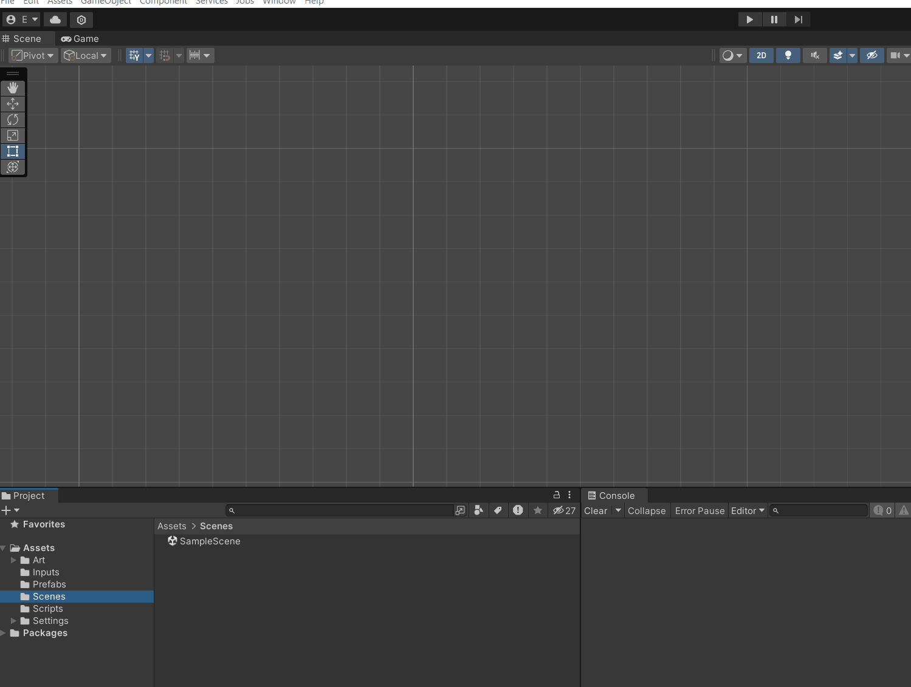

??? question "Why Did I Need to do That?"
    Some files that Visual Studio uses to provide many contextual coding features are often not uploaded to source control systems, so they won't be included when you clone or download from a repository.

    Therefore, it is usually a good idea (unless told otherwise) to regenerate these project files when you first download a repository before you wonder why everything looks broken in Visual Studio!

Lastly, whenever you download a new Unity project, Unity typically doesn't know what scene it should open, so you'll wind up on an empty, unsaved one. Before continuing, open the `Scenes` folder in the *Project* window and open the *SampleScene*.

## Chapter 2: Scene and Art
In this chapter, we will get warmed up with the Unity Editor by building the Game Objects for what will eventually be our Player and Enemies. We'll also make quick use of our art assets so we have something pretty to look at.

### Adding the Background
The default grey background is pretty ugly, so let's pull in our background art to quickly remedy that.

In the project window, find `Art -> Backgrounds -> darkPurple`. This is a tilable PNG background which we can use to cover the entire screen space. Drag the *darkPurple* image asset into an empty space on the *Hierarchy* window to add it to the scene (ensure it hasn't been made a child of anything else).

If you were to try and resize the sprite using the *Scale* or *Rect* tool, you'll notice that it just stretches and distorts, which looks terrible. Instead, we must *tile* the sprite to allow it to repeat across a region instead of stretching.

To do so, select the new sprite we added to the *Hierarchy* to view it in the *Inspector*. Make the following changes:

* Draw Mode: Tiled
    * Size, Width: 35
    * Size, Height: 35

This will accomplish the desired tiling effect, which looks much better than stretching it! Let's also rename the Game Object from '*darkPurple*' to '*Background*'.

Lastly, you may have noticed that the background's Inspector window is displaying a warning about the sprite's Mesh Type. We'll resolve this by doing exactly what it says: Select the `Art -> Backgrounds -> darkPurple` asset in the *Project* window and change the Mesh Type to 'Tiled', then hit apply.

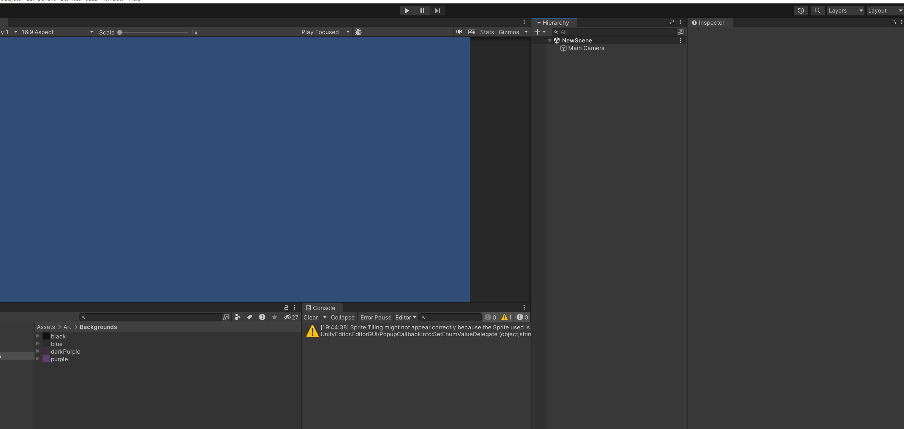

Note that you can of course use any of the other backgrounds provided if you like them more, and you can also select the sprite Game Object and change it's *Color* property to tint them as well!

### Creating the Enemy and Player Game Objects
Let's take a moment to discuss exactly what our player and enemies will do. 

Our enemies are simple, they will...

* Float across the playable area in a single direction.
* Upon colliding with the Player, destroy both the Player and themselves.

Our Player will be slightly more complicated:

* Fly around in any direction using the WASD keys, coming to a stop with no input.
* Rotate towards the direction it is flying in.
* Shoot lasers which can destroy enemies.

While we're on the topic of pulling in our art, let's set up the visuals and initial Game Objects for the enemies and Player right now.

##### Player
Start by Right-Clicking on the *Hierarchy* window and selecting 'Create Empty'. Name the new Game Object *'Player'*. 

We'll then add a empty Game Object to the *Player*. Do this by right-clicking *Player* and 'Create Empty' on that. Name the new child object *'Visuals'*

Lastly, we'll add a sprite the *Visuals* object which will be our graphics for the Player. Right-Click on *Visuals* and do `2D Object -> Sprite -> Square`. Name it *Base Sprite*. 

On *Base Sprite*, we can use whatever sprite we would like for our player by dragging it into the `Sprite` field. You can find a bunch of very suitable candidates in `Art -> Sprites` within the *Project* window. I'll be using *playerShip2_red*.

??? tip "Selecting Reference Types"
    In addition to supporting drag-and-drop, reference-type fields will often allow you to press the circular-selector button to see all items in the project that can fill in the field, which you can then search from. 
    
    This is often a much faster way to fill in things from the inspector if you don't have them already visible in the *Project* window!

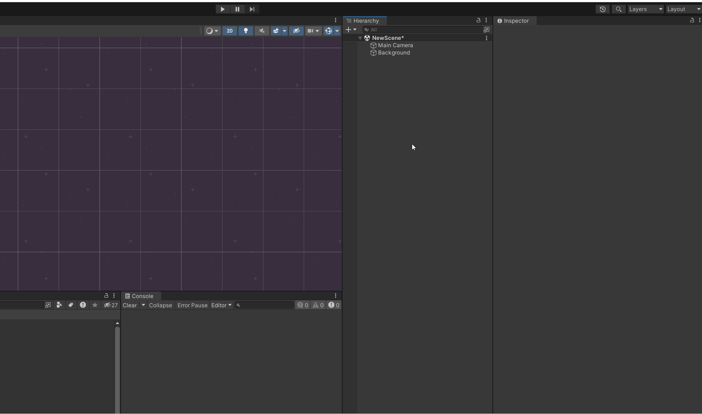

You __may__ have noticed an issue here, which is that the Player sprite appears to be drawing *underneath* the background, thusly making it not visible (This may or may not occur depending on a couple of factors, but it needs to be fixed regardless).

To fix this, we need to set up *Sprite Sorting Layers* which define what groups of sprites should render on top of others. Fold out the *Layers* drop down button in the top-right of the editor, and select '*Edit Layers*'.

You can then fold down the *Sorting Layers* list and press the `+` button to add a few more. I'll be using the following layers **in this specific order**:

* 0) Background
* 1) Default
* 2) Projectile
* 3) Enemy
* 4) Player

Things at the bottom of the list will *always* render in front of things closer to the top of the list.

Select the *Background* and change the *Sprite Renderer*'s `Sorting Layer` to `Background`. Change the Player's *Base Sprite*'s `Sorting Layer` to `Player`. There should be no rendering conflicts now!

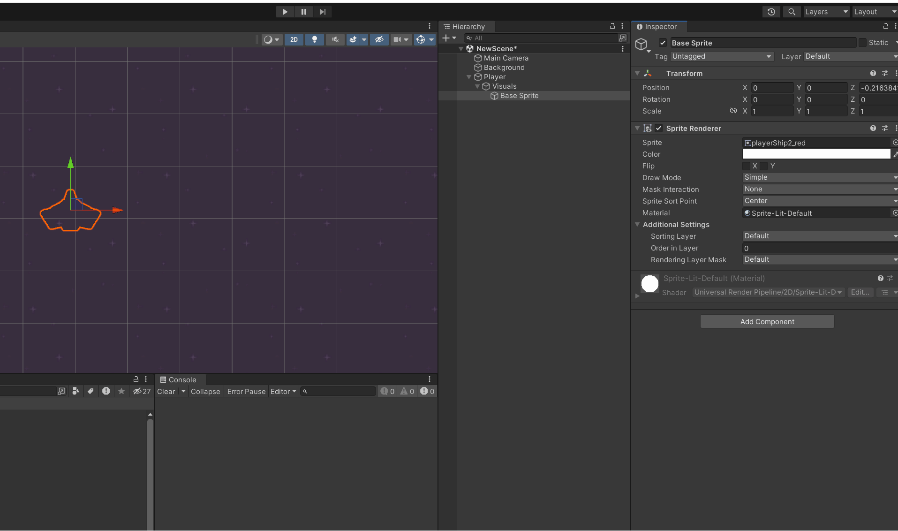

##### Enemy
We've got a great opportunity to be lazy here. Let's duplicate the *Player* Game Object (select it and press ++ctrl+d++), then rename it to *'Enemy'*. You can then change its *Base Sprite*'s `Sprite` to one of the asteroid sprites. I'll be using `Art -> Sprites -> meteorBrown_big1`.

Don't forget to change sorting layer for the enemy's base sprite to `Enemy` instead of `Player`. Also, move the *Enemy* a bit below the *Player* (but still on screen) so that they aren't overlapping.

## Chapter 3: Enemy Scripts
In order to get our enemies to do exactly what we want them to, we'll need to write custom scripts to dictate what they should do when the game runs through code. Since the design goals for the Enemy are much simpler than for the Player, we'll start on the Enemy.

### Component Set Up
Before we write our own script, we'll need to do a little more configuration on the *Enemy* Game Object before hand.

To start, whenever we want to allow a Game Object to move in anything besides the most simple of ways, we generally want to add a *Rigidbody* (Or *Rigidbody2D* if you're using 2D, which we are!) component. Doing so allows the Game Object to do the following:

* Move at run time using the Unity Physics System and be affected by various kinematic forces.
* Register collisions with other Rigidbodies.

We would like to do both of those, so select the *Enemy* Game Object and do `Add Component -> Rigidbody2D`.

If you enter play mode immediately after doing so, you'll actually notice your enemy fall off the screen due to the implicit gravity force that Rigidbody2D's come initialized with!

We don't really want gravity here though. In fact, we would like to have very explicit control over how our enemy moves (In other words, we don't want the physics engine doing anything to it unless we code it that way). Fortunately, changing the Rigidbody2D's `Body Type` property to `Kinematic` in the *Inspector* will do exactly that- the Enemy will no longer be affected by gravity or bounced around by other objects. Cool.

Before we continue, we do still need to add a *Collider* to this Game Object configured to be a Trigger so that we can tell when it hits the Player. Do `Add Component -> Circle Collider` to do so. Check the `Is Trigger` property, and press the `Edit Collider` button to change the hitbox to your liking (or use the `Radius` property to numerically change the size).

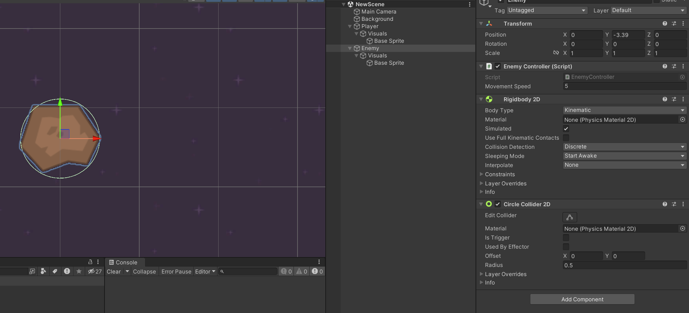

Note: The `Enemy -> Circle Collider 2D -> Is Trigger` property should be **checked** in the screenshot above, sorry!

Great! That's all the set up we need to start scripting!

### EnemyController Script
Let's now build the script that will add our custom behavior for these Enemies. In the Scripts folder within the *Project* window, Right-Click and do `Create -> C# Script`, name it *'EnemyController'* and double-click to open it in your code editor.

Once we are done writing this script, we will be able to place it onto our *Enemy* Game Object as a component (just like the Rigidbody2D and Sprite Renderer) to apply the custom behavior.

##### Movement

For now, we'll write the following code in `EnemyController.cs`:

```cs title="EnemyController.cs" linenums="1"
using System.Collections;
using System.Collections.Generic;
using UnityEngine;

public class EnemyController : MonoBehaviour
{
    private Rigidbody2D _rigidbody;     // The rigidbody component on this enemy

    // Start is called before the first frame update
    void Start()
    {
        _rigidbody = GetComponent<Rigidbody2D>();

        _rigidbody.velocity = new Vector2(0f, 5f);
    }
}
```

???+ abstract
    Every script which derives from the `MonoBehavior` class will have a series of Events called on it at various times by Unity's script runner or other activites in your game. `void Start()` is one such Event- and the code within it starts once the Game Object the script is attached to enters the scene for the first time (which will be when the game starts for any object already in the scene). This makes it a good place for initialization.

    To get our *Enemy* to move, we need to set the velocity on its *Rigidbody2D* component we attached through code- it'll fly in whatever direction we specify.

    Therefore, when the game starts, we use `GetComponent<Rigidbody2D>()` (Line 7) to search for the Rigidbody and store a reference to it- then set it's velocity to an upwards-pointing vector (0 on the X axis, 5 on the Y).

Return back to Unity and attach the new `EnemyController` component to the *Enemy* Game Object, then enter play mode to watch it fly off the top of the screen!

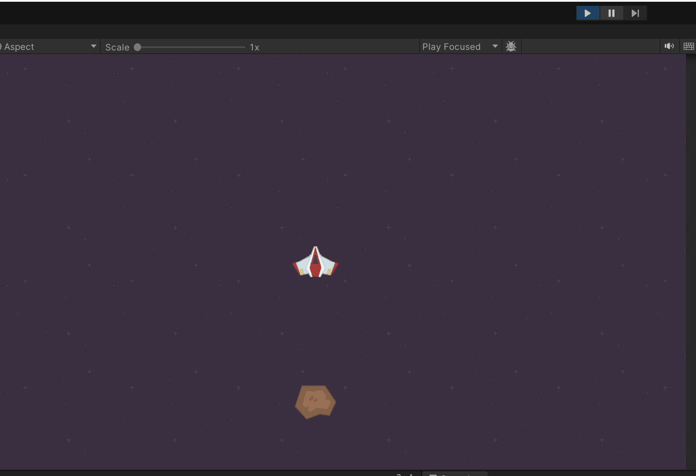

##### Movement Adjustments
There two things we would like to change about how we move the Enemy. First- in order to change the Enemy's speed, we currently have to go back into the code, change it, and recompile it. Not only is this a hassle, but it also means *all* enemies have to move at the same speed, which is very inflexible.

To fix this, make the following adjustments to the code:
```cs title="EnemyController.cs" linenums="1" hl_lines="7 8 17"
using System.Collections;
using System.Collections.Generic;
using UnityEngine;

public class EnemyController : MonoBehaviour
{
    [SerializeField, Tooltip("The enemy's movement speed in units per second")]
    private float _movementSpeed = 2f;

    private Rigidbody2D _rigidbody;     // The rigidbody component on this enemy

    // Start is called before the first frame update
    void Start()
    {
        _rigidbody = GetComponent<Rigidbody2D>();

        _rigidbody.velocity = new Vector2(0f, _movementSpeed);
    }
}
```

???+ abstract
    Adding the new class member `_movementSpeed` and putting the `SerializeField` attribute before it allows this value to be set in the *Inspector* window- so we can adjust it in the editor (even while the game is playing)!

    We then use that `_movementSpeed` in place of the hard-coded `5f` speed.

    Note that the `Tooltip('...')` attribute helps tell us what the proceding class member is used for- both here and  when we hover over that property in the Inspector.

If you go back to the editor and look at the *Inspector* for *Enemy*, you will see a new `Movement Speed` field which you can type custom values into. As mentioned in the Abstract, you can even adjust this value while in play mode!

---

The second issue we'd like to fix is that currently, the enemies will **only** ever move in the up direction (positive on the Y axis, assuming `Movement Speed` is positive). As you may have noticed in the thumbnail, we have enemies moving in any kind of direction, so let's fix that!

For this game, we use any projectile's Y-Axis (The *green* one, colloqually the *Up Axis* in 2D) as it's forward direction. Therefore, our Enemy's velocity should travel in that direction.

??? question "How Can I Tell What Direction a Game Object is 'Facing'?"
    In the Editor, select a Game Object, then ensure your rotation mode (Located in the top left of the *Scene* window, next to the tool shelf) is set to `Local`, not `Global`. 
    
    You can then select the *Move Tool* in the *Scene* window to look at the direction of the *Green* arrow to see the orientation of the object.

    You can rotate the Game Object to observe this Up-arrow change direction.

    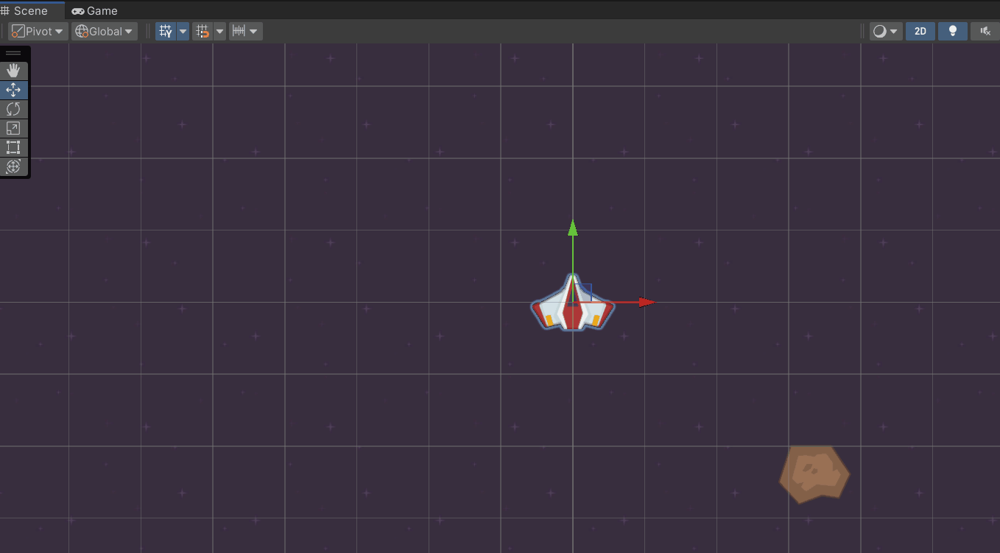

This is a lot simpler to do than it probably sounds, and just involves changing one line:
To fix this, make the following adjustments to the code:
```cs title="EnemyController.cs" linenums="1" hl_lines="17"
using System.Collections;
using System.Collections.Generic;
using UnityEngine;

public class EnemyController : MonoBehaviour
{
    [SerializeField, Tooltip("The enemy's movement speed in units per second")]
    private float _movementSpeed = 2f;

    private Rigidbody2D _rigidbody;     // The rigidbody component on this enemy

    // Start is called before the first frame update
    void Start()
    {
        _rigidbody = GetComponent<Rigidbody2D>();

        _rigidbody.velocity = transform.up * _movementSpeed; // Set the linear velocity of this enemy in units per second.
    }
}
```

???+ abstract
    `transform.up` provides a directional Vector which matches the Green arrow of the Game Object the script is attached to. We can then multiply that Unit Vector by our `_movementSpeed` to make it move according to our desired speed.

    For example, now if our enemy is pointed towards the right, the velocity will be set to `(1, 0) * 2`, rather than `(0, 1) * 2`. Similarly, if it's pointed diagonally down and to the left, it will be `(-0.71, -0.71) * 2`.

    Note that you can get the direction for any of the local axes via `transform.right` and `transform.forward` (3D). You can also *set them* to a particular value to align the Game Object's axis with the direction you provide, which is *VERY USEFUL*.

As a side note, don't be put off if the talk of Vectors and Directions is a little lost on you- it can take a moment for it to click into place for some. If it doesn't come naturally, feel free to look up some supportive information- this article from Unity is a good start:

[Unity's Vector Cookbook](https://docs.unity3d.com/560/Documentation/Manual/UnderstandingVectorArithmetic.html)

(Note that these pages report as legacy, but all information is valid since it's mathematics. Be sure to use the `->` buttons to view additional pages)

Anyways, rotate your Game Object to change it's up direction and play it will now travel in the correct direction!

### Destroying the Player
We will modify our `EnemyController` script to do the following:

1. Watch out for any objects entering the enemy's trigger collider.
2. Upon a trigger collision, check to see if the thing we collided with is the *Player*.
3. If so, destroy both of us.

Let's implement that with the following code on `EnemyController`:
```cs title="EnemyController.cs" linenums="1" hl_lines="20-24"
using System.Collections;
using System.Collections.Generic;
using UnityEngine;

public class EnemyController : MonoBehaviour
{
    [SerializeField, Tooltip("The enemy's movement speed in units per second")]
    private float _movementSpeed = 2f;

    private Rigidbody2D _rigidbody;     // The rigidbody component on this enemy

    // Start is called before the first frame update
    void Start()
    {
        _rigidbody = GetComponent<Rigidbody2D>();

        _rigidbody.velocity = transform.up * _movementSpeed; // Set the linear velocity of this enemy in units per second.
    }

    private void OnTriggerEnter2D(Collider2D collision)
    {
        Destroy(collision.gameObject);
        Destroy(gameObject);
    }
}
```

???+ abstract
    `void OnTriggerEnter2D(Collider2D)` is another Unity Event- this one will run whenever another collider enters the Trigger Collider present on this Game Object (with the `collision` parameter being the other collider detected).

    Quite simply, we will use the `Destroy(GameObject)` method to destroy the other thing we collided with, then Destroy ourselves.

You will need to add a `Rigidbody2D` and `CircleCollider` to the *Player* in order to register collisions against it. Configure both components the exact same way as you did on the *Enemy*.

Note, however, that the code above will cause the enemy to destroy *any* thing is collides with, not just the Player.

There are a couple ways to determine if the thing we collided with is a particular Game Object we're looking for, but the most common way is to check to see if it has a particular component unique to Player.

In Chapter 4, we'll need to add a `PlayerController` to our Player, so let's go ahead and do that now so that we can search for that component while doing collsion resoluton.


In the Project Window, make a new `PlayerController` C# Script, add it as a component to the Player (we do not need to edit the script yet), then make the following changes to `EnemyController`:
```cs title="EnemyController.cs (fragment)" linenums="20" hl_lines="20-23"
private void OnTriggerEnter2D(Collider2D collision)
{
    // On collision with another game object, check if it's the player.
    // If so, destory it and this enemy.
    if (collision.GetComponent<PlayerController>() != null)
    {
        Destroy(collision.gameObject);
        Destroy(gameObject);
    }
}
```
???+ abstract
    Upon hitting another collider, we'll search its Game Object to see if it has a `PlayerController` component. Since `GetComponent` will return `null` if it cannot find the type searched for, we can check against that.

    If a `PlayerController` is found, then we can procede with destroying the Player and the Enemy.
    
    If you'd like, you can confirm this works by ++ctrl+d++ duplicating the *Enemy*, rotating them to collide with one another, and witnessing them pass through one another harmlessly!

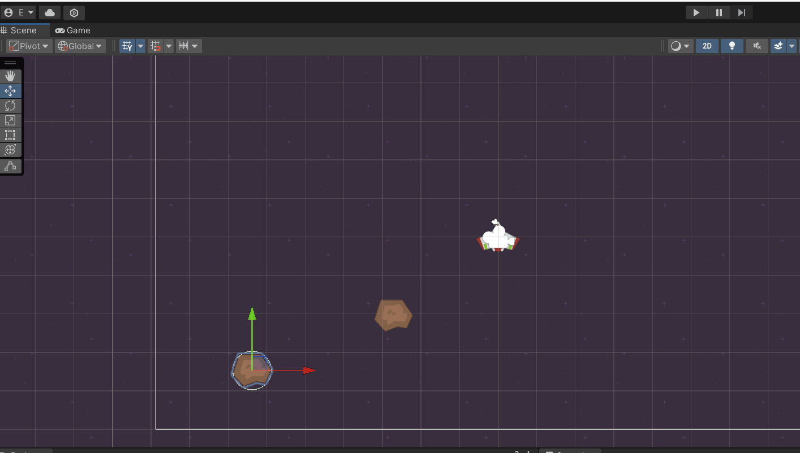

## Chapter 4: Player Scripts
The script for the Player will be a little more complicated, but now that we've covered the basics with the Enemy, we can just focus on the new details. Let's work on getting the Player moving using the User's input!

##### Input Actions Set-Up

Before we write our script, we have to create an *Input Actions* asset which will describe how our user will interact with the game.

In short, an *Input Actions* asset contains a list of *Actions*, each with one or more *Bindings* which trigger them. Scripts can hook into Actions in order to respond to and read data from any time it is triggered.

Fortunately, Unity has a shortcut to make a pre-configured *Input Actions* asset which will have all of the Actions and Bindings we'll need. We'll take advantage of this now.

Select the *Player* Game Object and add a *Player Input* component. Below the `Actions` property, press the *Create Actions...* button and save the asset it offers to create.

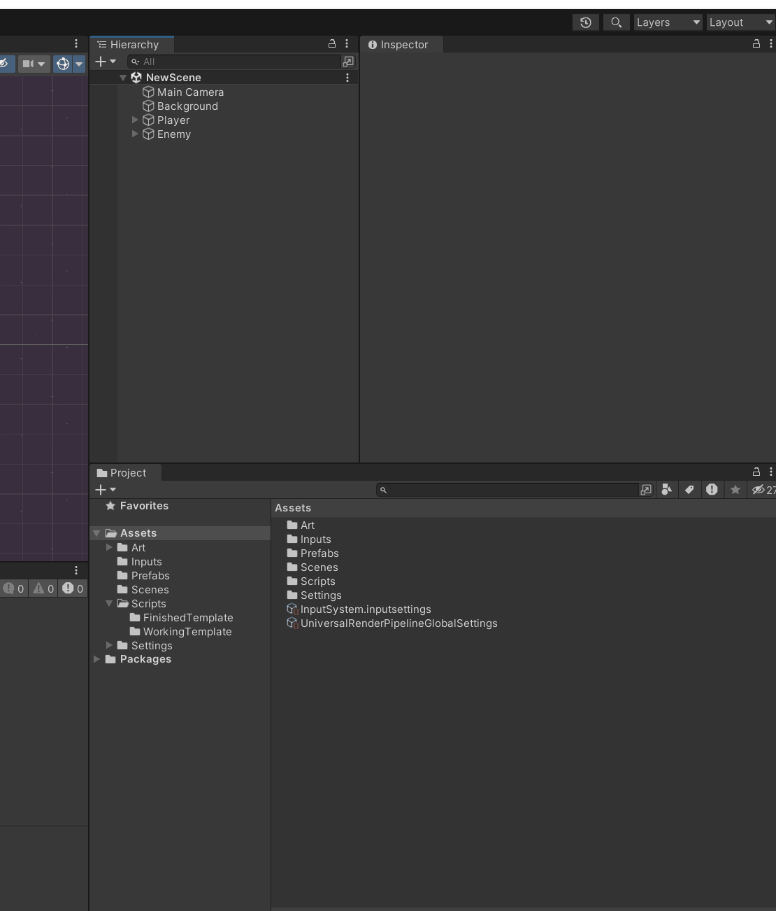

The Input Actions editor will open up (you can double-click the newly made asset in the project window if you lost it). You can see that it has created a mapping with the following Actions:

* Move
    * Generates a 2D Input Vector using the WASD (A-D for X, W-S for Y) keys OR the controller left joystick.
* Look
    * Creates a 2D Input Vector using the Mouse Delta OR controller right joystick (Irrelevant to us).
* Fire
    * Triggered with a Left Mouse Button click or controller Right Trigger press.

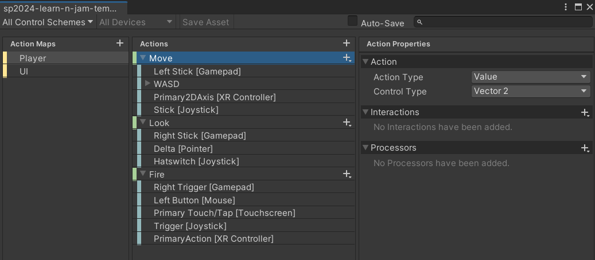

The `Move` Action will produce a 2D Vector (X, Y) we can use from the Player's Input. For example, if the player is holding the W key, it will return (0, 1) for up. It would also return (-0.71, 0.71) if they were holding the W & A (The result is normalized to create a direction Vector).

While we could go into more detail about building actions and bindings from scratch, we want to keep things simple. We will touch on creating new actions and bindings in future modules.

##### PlayerController.cs

In Chapter 3, we attached an empty `PlayerController.cs` script (as well as a Rigidbody2D and a Circle Collider) to the Player. We will now fill out that script here.

Before we start, some explaination on the `Player Input` component is in order. In short, it listens for any Action to be triggered from the *Input Actions* it is watching, and then sends a message to every MonoBehavior script on the **same Game Object as itself**. Any component that receives this message can successfully respond to it if it has a function that matches the method's signature.

You can see which Actions will be messaged out in the info box at the bottom of it's inspector shelf- it has one for each Action, following the pattern `On<ActionName>`. Therefore, if we wanted to catch the `OnMove` action, our script will need a `void OnMove(InputValue value)`.

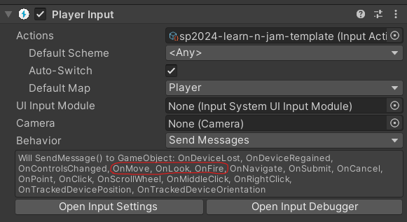

Let's capture that data and print it out to ensure it's working. Make the following edits to `PlayerController.cs`:
```cs title="PlayerController.cs" linenums="1" hl_lines="2 18-21"
using UnityEngine;
using UnityEngine.InputSystem;

public class PlayerController : MonoBehaviour
{
    // Start is called before the first frame update
    void Start()
    {
        
    }

    // Update is called once per frame
    void Update()
    {
        
    }

    private void OnMove(InputValue movementValue)
    {
        Debug.Log(movementValue.Get<Vector2>());
    }
}
```

???+ abstract
    Ensure you don't miss line 2, which includes the `InputSystem` namespace into this file.

    As mentioned before, the `OnMove` function will called by a broadcasted message sent from the `Player Input` component, which may seem obtuse if you're not used to messaging systems. The message contains a `InputValue` object which contains a bunch of information about the Action that was performed.

    Primarily, we care to retrieve the value of it using the `Get` method (which must be casted to a `Vector2`, which is what we are expecting to get out of the `Move` action as dictated in the Input Actions asset).

    Also, be sure that the `void OnMove(InputValue movementValue)` function signature is **EXACTLY** correct- the message will **not** be caught if the script does not have a matching function signature.

Enter Play Mode and use either your WASD keys or a controller's Left Joystick- you'll notice your inputs are being logged to the *Console* window!

---

Now that we have access to the user's movement input within this script, we can use that to allow the *Player* to move under our control!

... But you actually know everything you need in order to make that work yourself from working on the `EnemyController`. Try implementing this yourself! Here are two hints:

1. You will need to store the `movementValue.Get` results into a member-level variable to make it accessible by other functions within the script. You can create a `private Vector2 _movementInput = Vector2.zero` variable within the `PlayerController` to do this.
2. Instead of using the `Start` method, you will actually want to handle updating the velocity in the `FixedUpdate` method (Just add `Fixed` in front of the `Update` method in the script).

Fold out the Admonition below to see our answer after you've given it a shot:

??? success "Solution"
    ```cs title="PlayerController.cs" linenums="1" hl_lines="7 9 10 14 18-21 27"
    using UnityEngine;
    using UnityEngine.InputSystem;

    public class PlayerController : MonoBehaviour
    {
        [SerializeField, Tooltip("The player's movement speed in units per second.")]
        private float _movementSpeed = 5f;

        private Rigidbody2D _rigidbody;
        private Vector2 _movementInput = Vector2.zero;

        void Start()
        {
            _rigidbody = GetComponent<Rigidbody2D>();
        }

        // Frame-rate independent. Used for physics calculations.
        void FixedUpdate()
        {
            _rigidbody.velocity = _movementInput * _movementSpeed;
        }

        // Unity sends a message to this function whenever it detects input from anything bound to the "Move" action.
        // Grab the target vector from the input value and store it for use in fixed update.
        private void OnMove(InputValue movementValue)
        {
            _movementInput = movementValue.Get<Vector2>();
        }
    }
    ```

    Instead of just using the Object's up direction to move, we use the Input direction instead (still multiplying it by a speed!), which we store in a member variable to make it accessible to the entire class.

    FYI, the `void Update` method is another Unity Event method, which is called continuously per each frame of your game. If you imagine your game running at 60 Frames Per Second, whatever code is within the `void Update` method would then be called 60 times a second, making it good for runtime code.

    The `void FixedUpdate` method will be triggered 50 times a second, no matter how fast (or slow) the game is running. This consistent timestep makes it very useful for physics calculations, so Unity puts all of it's Physics processing on those timesteps. You should too to ensure better physics stability.

This looks a little goofy though, so let's also rotate the *Player* in the direction that it's currently moving in. Making the following change to `void FixedUpdate()`:

```cs title="PlayerController.cs (fragment)" linenums="1" hl_lines="6-9"
...
void FixedUpdate()
{
    _rigidbody.velocity = _movementInput * _movementSpeed;

    if (_movementInput != Vector2.zero) // Avoid rotating the player to an upward resting position when not moving.
    {
        transform.rotation = Quaternion.LookRotation(Vector3.forward, _movementInput);
    }
}
...
```

???+ abstract
    The `Quaternion.LookRotation()` method gets a rotation from a direction, so we change the Player's direction to the input direction.

    Note that the first parameter to `LookRotation` is the axis that the rotation occurs on. For 2D games, this will always be `Vector3.forward`, which aligns with the *'Topdown'* Z-axis, or the direction our camera is viewing the game plane on.

    `Quaternion.LookRotation` will give us an anomlous result if the input vector we pass is zero, so we use an `if` to avoid running it if the player is not providing input at this time!

##### Smoother Movement
Right now, our movement and rotation is instantaneous, which doesn't look too appetizing. With a bit more effort, we can smooth it out to really improve the game feel of our Player Controller.

Add the following changes:

```cs title="PlayerController.cs" linenums="1" hl_lines="8 11 15 16 28-33 38-42"
...
public class PlayerController : MonoBehaviour
{
    [SerializeField, Tooltip("The player's movement speed in units per second.")]
    private float _movementSpeed = 5f;

    [SerializeField, Tooltip("Amount of smoothing time applied to velocity changes")]
    private float _movementSmoothingTime = 0.35f;

    [SerializeField, Tooltip("The player's angular rotation speed in degrees per second.")]
    private float _rotationSpeed = 500f;

    private Rigidbody2D _rigidbody;
    private Vector2 _movementInput = Vector2.zero;
    private Vector2 _currentMovement = Vector2.zero;
    private Vector2 _movementSmoothingVelocity = Vector2.zero;

    void Start()
    {
        _rigidbody = GetComponent<Rigidbody2D>();
    }

    // Frame-rate independent. Used for physics calculations.
    void FixedUpdate()
    {
        // Gradually changes a vector towards a desired target over time.
        // Used to smooth player movement to avoid abrupt, jittery movement.
        _currentMovement = Vector2.SmoothDamp(
            _currentMovement,                   // Our current velocity
            _movementInput,                     // The player's input, we want to *reach* this
            ref _movementSmoothingVelocity,     // our current *acceleration*
            _movementSmoothingTime              // smoothing duration, lower is faster.
        );
        _rigidbody.velocity = _currentMovement * _movementSpeed; // Set the linear velocity of the player in units per second.

        if (_movementInput != Vector2.zero) // Avoid rotating the player to an upward resting position when not moving.
        {
            Quaternion targetRotation = Quaternion.LookRotation(Vector3.forward, _currentMovement);

            // Gradually rotate the player towards the direction of movement.
            // Used to smooth player rotation to avoid abrupt, snappy turns.
            transform.rotation = Quaternion.RotateTowards(transform.rotation, targetRotation, _rotationSpeed * Time.fixedDeltaTime); // Set the player's rotation.
        }
    }

    ...

}
```

???+ abstract
    Smoothing out some kind of motion generally involves doing the following:
    
    1. Find some *Target Value* that we'd like to **reach** (In this case, matching the rigidbody velocity to the player input).
    2. **Accelerate** our *Current Value* **TOWARDS** the *Target Value* over time.
    3. Use the *Current Value* as the acting value as it tries to reach the *Target Value*.

    In our circumstance, we create a sort of intermediary `_currentMovement` vector which tries to "catch up" to the `_movementInput` each Fixed Update using the `SmoothDamp` method.

    We also linearly rotate the the *Player* towards the `_currentMovement` direction as well to smooth out the rotation.

??? tip "Smoothing Types"
    Note that there are multiple ways of smoothing a value, and it's important to note them.

    * Linear Acceleration (or MoveTowards). This type adds a flat increment to the *Current Value* each step until it reaches the *Target Value*.
    * Linear Interpolation (Lerp). This smoothing method will move the *Current Value* some percentage of the distance between itself and the *Target Value* every step. This creates a motion which starts off very fast, but slows down as it reaches the target.
    * Smooth Damp. This rather complex smoothing algorithm aims to simulate spring-motion. It can 'appear' to work a lot like Lerp, but has much better fidelity and fluidity at the cost of being a little more annoying to set up.

You should now notice your Player is significantly smoother and more satisfying to control. You can play around with the `PlayerController: _movementSmoothingTime` in the inspector to change the feel- larger values will make the player feel heavier to turn and generally less agile, lower numbers will be snappier.

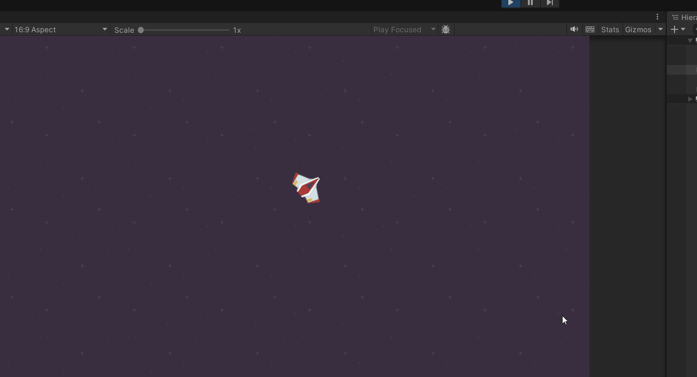

In case you forgot, our game is gamepad compatible. Plug in a controller to see even finer control!

Don't worry if the math behind smoothing is a litle daunting right now. You will *absolutely* have more opportunities to practice it in your future projects- much like Vector mathematics, it's ubiquitous across almost all parts of making games feel good.

## Chapter 5: Laser Gun
In this chapter, we'll create the feature which allows the player to fire lasers that can destroy enemies. This will serve as our introduction to Instantiating (or *spawning*) Game Objects while the game is playing- a vital component of making games.

##### Laser Prefab

To start, we will create a Laser *Prefab*- a premade Game object we can clone copies of. 

Our lasers will work very similarly to the enemies- travel in a straight line, but kill enemies instead of the player! Aside from that minor detail, they will be almost identical in terms of scripting and components.

You can see where this is going, let's be lazy again! ++ctrl+d++ duplicate the Game Object, and the **remove the `Enemy Controller` component** (using the three dots icon in it's drawer on the inspector). Also rename the object to *'Laser Projectile'*.

Change the *Base Sprite*'s sprite to one of the assets that resemble a laser. We're using `Art -> Sprites -> Lasers -> laserRed01`. Change the `Sorting Layer` to `Projectile`.

To turn this *Laser Projectile* into a prefab, open the *Prefabs* folder in the *Project* window, then Drag and Drop the *Laser Projectile* Game Object **from the Inspector into the empty space within the Project window**.

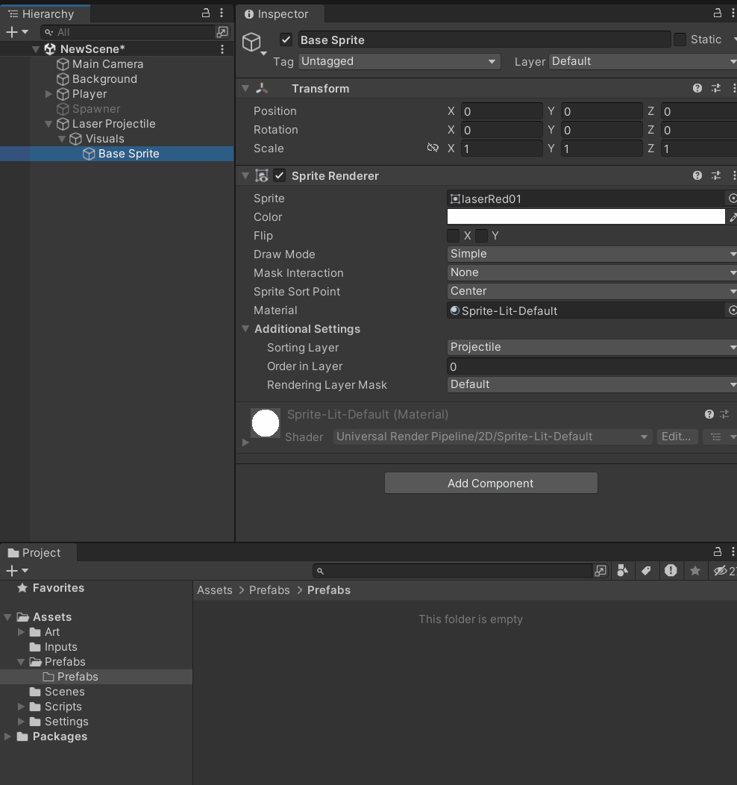

???+ warning "Editing Prefabs"
    Note that once you create a Prefab, you can open up the Prefab for editting by double clicking it in the Project window.

    If you make changes to an *INSTANCE* of a prefab in a scene, those changes will **not apply to the prefab (and thusly any copies made from it), it will only apply to that single instance**.

    Again, just be sure that you double click the prefab to open it up in isolation to edit the prefab itself to avoid confusion. If you do make edits to a prefab instance and want to apply it to the Prefab itself, you can use the *Overrides* dropdown in the Inspector window on the instance and apply the changes. 


... Did you remember to remove the `EnemyController` component from the new Laser object? Okay, good!


##### Laser Projectile Script

As mentioned before, our Laser script will be nearly identical to the EnemyController, we just need to change the Component we check against to `EnemyController`.

Create a `LaserProjectile.cs` C# script, attach it to the *Laser Projectile* **PREFAB**, and code up the following:

```cs title="LaserProjectile.cs" linenums="1" hl_lines="21"
using UnityEngine;

public class LaserProjectile : MonoBehaviour
{
    [SerializeField, Tooltip("The projectile's movement speed in units per second")]
    private float _projectileSpeed = 10f;

    private Rigidbody2D _rigidbody;

    private void Start()
    {
        _rigidbody = GetComponent<Rigidbody2D>();

        _rigidbody.velocity = transform.up * _projectileSpeed; // Set the linear velocity of this projectile in units per second.
    }

    private void OnTriggerEnter2D(Collider2D collision)
    {
        // On collision with another game object, check if it's an enemy.
        // If so, destory it and this projectile.
        if (collision.GetComponent<EnemyController>())
        {
            Destroy(collision.gameObject);
            Destroy(gameObject);
        }
    }
}
```

If you place down a *Laser Projectile* now and aim it towards an Enemy (You can set the Enemy's `Movement Speed` to `0` to make this easier), it will destroy the enemy. Great!

##### Player Laser Gun
Now we need to add a script that allows the user to spawn these lasers using user input. Recall that the Input Actions asset we had generated for us came with a `Fire` Action bound to Left Mouse Button and Right Trigger.

Before we write the script, whenever we are making something which "fires" something, you generally want a dedicated *Fire Point* Game Object which the projectiles will come out from.

Add an Empty Game Object to the *Player* (Called *Fire Point*), and position it so that it is located right at the tip of the ship's nose. **Make sure the green-axis of the *Fire Point* is still pointed upwards**, and we're good to go.

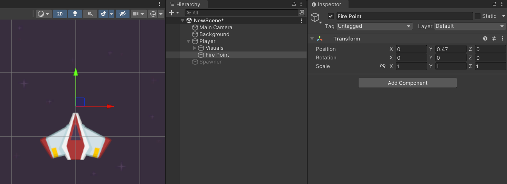

We'll do all of our weapon handling in a new script. Let's make one called `PlayerLaserGun.cs` and add it to the *Player* Game Object as a component:

```cs title="PlayerLaserGun.cs" linenums="1"
    using UnityEngine;
    using UnityEngine.InputSystem;

    public class PlayerLaserGun : MonoBehaviour
    {
        [SerializeField, Tooltip("A game object to use as a projectile.")]
        private GameObject _projectilePrefab;

        [SerializeField, Tooltip("Where to shoot projectiles from.")]
        private Transform _firePoint;

        private void OnFire(InputValue buttonValue)
        {
            FireProjectle();
        }

        // Create a projectile object at the fire point's current position and rotation.
        private void FireProjectle()
        {
            Instantiate(_projectilePrefab, _firePoint.position, _firePoint.rotation);
        }
    }
```
???+ abstract
    In order to instantiate a Prefab through code, we generally need two things:
    
    1. A reference to the Prefab asset.
    2. A position and rotation to instantiate the object with.

    We provide both using `SerializeField` attributed variables at the top of the file, which allows us to drag-and-drop the Prefab asset from the Project window and the *Fire Point* Game Object we created in the last step.

    This will spawn in a clone of the Laser Projectile prefab and their own script will send them flying away!

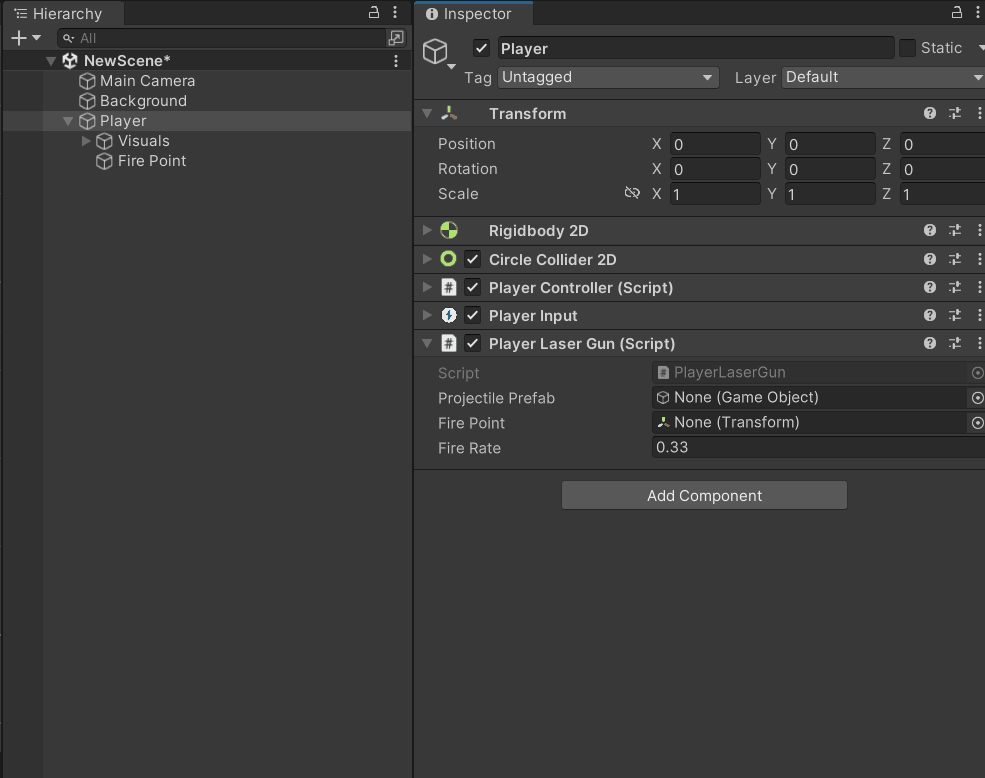

Once this is implemented and all fields are filled in, you can enter play mode and press the fire buttons to shoot lasers!

##### Auto-fire
As you may have noticed, the user is capable of spamming the *Fire* action very quickly to shoot a ton of lasers. Let's add a limit to the number of lasers they can spawn and also make the weapon fire fully automatically for comfort.

Make the following changes to `PlayerLaserGun.cs`:
```cs title="PlayerLaserGun.cs" linenums="1" hl_lines="13 15-17 19-36 42"
using UnityEngine;
using UnityEngine.InputSystem;

public class PlayerLaserGun : MonoBehaviour
{
    [SerializeField, Tooltip("A game object to use as a projectile.")]
    private GameObject _projectilePrefab;

    [SerializeField, Tooltip("Where to shoot projectiles from.")]
    private Transform _firePoint;

    [SerializeField, Tooltip("How frequently to shoot projectiles in seconds.")]
    private float _fireRate = 0.33f;

    private float _fireTimer = 0f;
    private bool _isReadyToFire = false;
    private bool _isFireHeld = false;

    void Update()
    {
        // A simple timer that works by subtracting the time between updates, or frames,
        // from the timer variable, counting down from whatever the fire rate is.
        if (_fireTimer > 0f)
        {
            _fireTimer -= Time.deltaTime;
        }

        _isReadyToFire = (_fireTimer <= 0f); // Once the timer counts down to zero, the projectile is ready to fire.

        if (_isFireHeld && _isReadyToFire)
        {
            FireProjectle(); // Create a projectile object.
            _fireTimer = _fireRate; // Reset the timer.
            _isReadyToFire = false;
        }
    }

    // Unity sends a message to this function whenever the player presses or releases something bound to the "Fire" action.
    // Store whether or not input's pressed to use in update.
    private void OnFire(InputValue buttonValue)
    {
        _isFireHeld = buttonValue.isPressed;
    }

    // Create a projectile object at the fire point's current position and rotation.
    private void FireProjectle()
    {
        Instantiate(_projectilePrefab, _firePoint.position, _firePoint.rotation);
    }
}
```
???+ abstract
    The first thing we do is capture whether or not the Fire button is held by reading the `isPressed` value.

    In the `void Update()` method, we create a simple timer by subtracting the time between frames (`Time.deltaTime`) from an accumulator, which, when less than zero, indicates the cooldown is over. 
    
    If the cooldown is over **and** the player is holding the fire button, we shoot and reset the timer.

One final thing to change- by default, *Button*-type actions only trigger when they are pressed down. In order for this to work, we also need to change this Action in the Input Actions to report when the button is released as well.

Open up the *Input Actions* asset, select `Fire` and press the `+` dropdown along the header called *Interactions* on the right. Select *Press*.

Change the `Trigger Behavior` to `Press and Release`, then click *Save Asset* at the top. This will make this Action trigger on both button down and up inputs.

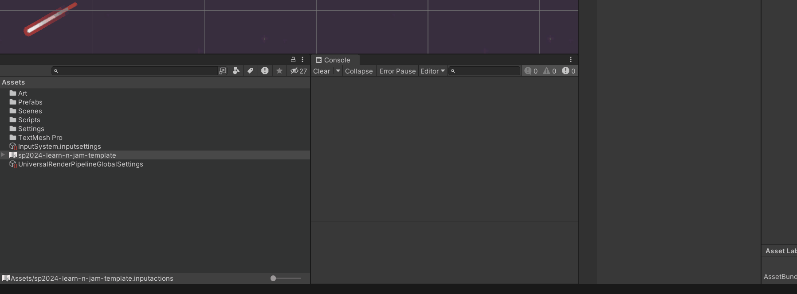

Run your game and hold down one of the Fire inputs- you now have an auto-firing laser gun!

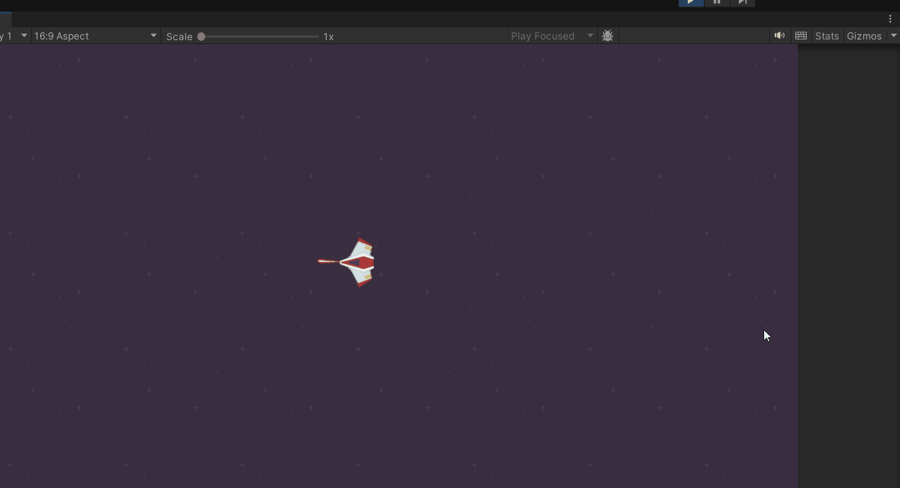

##### Timed Destroy
One quick thing. You may have noticed that your shots never disappear and wind up clogging up the Hierarchy (and thusly, unnecessarily consume Memory and CPU usage as they sail into the great beyond).

Let's create a component which will automatically destroy the Game Object it is attached to after a couple seconds to help with clean up.

Create a new Script `TimedDestroy.cs`. Add it to the *Laser Projectile* **PREFAB**, and edit it:

```cs title="TimedDestroy.cs" linenums="1"
using UnityEngine;

public class TimedDestroy : MonoBehaviour
{
    [SerializeField, Tooltip("Number of seconds after spawning that the object will destroy itself.")]
    private float _destroyTime = 6f;

    private float _spawnTime = 0f;

    // Start is called before the first frame update
    void Start()
    {
        _spawnTime = Time.time;
    }

    // Update is called once per frame
    void Update()
    {
        if (Time.time > _spawnTime + _destroyTime)
            Destroy(gameObject);
    }
}
```
???+ abstract
    Dead simple!

    We allow the time before destruction to be set in the inspector. Every update, we see if the game time is greater than the time we spawned in at (in `Start`) **plus** that destroy time, destroying if so.

    As you noticed, this is a different way of implementing a timer than we had in the last script. Use whichever one you like better- they're both computationally similar.

Your lasers will now despawn after six seconds!

## Chapter 6: Spawner
We're almost done! The last thing to do is create some *Enemy Spawners* which will fire enemies into the play area from afar. This will effectively work like a simplified version of our `PlayerLaserGun` with a few changes.

Create an Empty Game Object in the Hierarchy called *Spawner*. Position it somewhat to the side of the player so we don't immediately hit them with an Enemy.

???+ tip "Game Object Markers"
    For Game Objects that have no Visuals, it can be easy to lose them in the Scene window (You know, on account of them not being visible).

    In the Inspector window for a selected Game Object, you can click on the Dropdown box to the left of the Name field to assign a marker gizmos to it, making it visible to you.

    I recommend doing this for the *Spawner* object.

    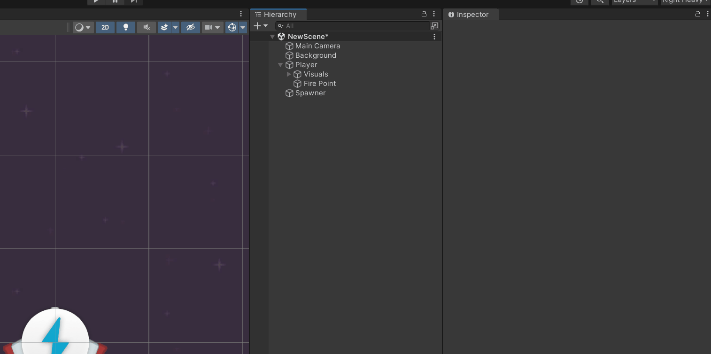

If you haven't already, take the *Enemy* Game Object and drag it into your Prefabs folder to create a Prefab of it. Again, we need to create a Prefab of an object if we would like to Instantiate (spawn) it.

Now create a `Spawner.cs` script, attach it to your *Spawner* Game Object, and add the following code:

```cs title="Spawner.cs" linenums="1"
using UnityEngine;

public class Spawner : MonoBehaviour
{
    [SerializeField, Tooltip("A game object to spawn.")]
    private GameObject _prefab;

    [SerializeField, Tooltip("How frequently to spawn game objects in seconds.")]
    private float _spawnInterval = 5f;

    private float _spawnTimer = 0f;
    private bool _isReadyToSpawn = false;

    void Update()
    {
        // A simple timer that works by subtracting the time between updates, or frames,
        // from the timer variable, counting down from whatever the spawn rate is.
        if (_spawnTimer > 0f)
        {
            _spawnTimer -= Time.deltaTime;
        }

        _isReadyToSpawn = (_spawnTimer <= 0f); // Once the timer counts down to zero, the game object is ready to spawn.

        if (_isReadyToSpawn)
        {
            // Randomly create a game object between the specified spawn radius.
            Instantiate(_prefab, transform.position, transform.rotation);
            _spawnTimer = _spawnInterval; // Reset the timer.
            _isReadyToSpawn = false;
        }
    }
}
```

Looks pretty similar to the `PlayerLaserGun.cs`, just like I promised, eh?

Go back to the editor, **be sure to drag and drop the Enemy Prefab into the `Prefab` field on the `Spawner` component for the *Spawner***, and enter play mode. The object is now shooting Enemies!

While we're at it, let's add the `TimedDestroy` component we made in Chapter 5 to the Enemy **PREFAB** so that they clean themselves up, too. Set the Destroy time to something a bit longer, like `12` or `15` seconds.

##### Dispersion
Our spawner is pretty uninteresting right now, because it always spawns Enemies in the exact same direction everytime. This won't do, because we need them to be shot out at various angles to keep things interesting.

We can resolve this by adding *Dispersion* (or *Spread*) to each Enemy we shoot out. That is to say, when we instantiate a new enemy, we'll rotate it by a random number of degrees off-axis so it flies in different directions each time.

Let's give it a shot:
```cs title="Spawner.cs" linenums="1" hl_lines="12 31-34"
using UnityEngine;

public class Spawner : MonoBehaviour
{
    [SerializeField, Tooltip("A game object to spawn.")]
    private GameObject _prefab;

    [SerializeField, Tooltip("Number of seconds between two consecutive spawns.")]
    private float _spawnInterval = 5f;

    [SerializeField, Tooltip("The number of degrees on either side of the Y (green) axis to randomly spawn game objects between.")]
    private float _spawnDispersion = 30f;

    private float _spawnTimer = 0f;
    private bool _isReadyToSpawn = false;

    void Update()
    {
        // A simple timer that works by subtracting the time between updates, or frames,
        // from the timer variable, counting down from whatever the spawn rate is.
        if (_spawnTimer > 0f)
        {
            _spawnTimer -= Time.deltaTime;
        }

        _isReadyToSpawn = _spawnTimer <= 0f; // Once the timer counts down to zero, the game object is ready to spawn.

        if (_isReadyToSpawn)
        {
            // Randomly create a game object between the specified spawn radius.
            GameObject spawnedObject = Instantiate(_prefab, transform.position, transform.rotation);

            float dispersionAngle = Random.Range(-_spawnDispersion, _spawnDispersion); // Create a random offset angle
            spawnedObject.transform.Rotate(Vector3.forward, dispersionAngle);   // Apply rotation by created offset

            _spawnTimer = _spawnInterval; // Reset the timer.
            _isReadyToSpawn = false;
        }
    }
}
```
???+ abstract
    As it turns out, the `Instantiate` method actually returns a reference to the newly created Game Objected created by calling it.

    Therefore, we can use the `Random.Range` method to generate an offset rotation (in degrees) and rotate the spawned object's transform by that amount (Again, in 2D, we always rotate around the Z axis, which is `Vector3.forward` or `(0, 0, 1)`).

Jump in game, you'll notice your spawner has some dispersion now!

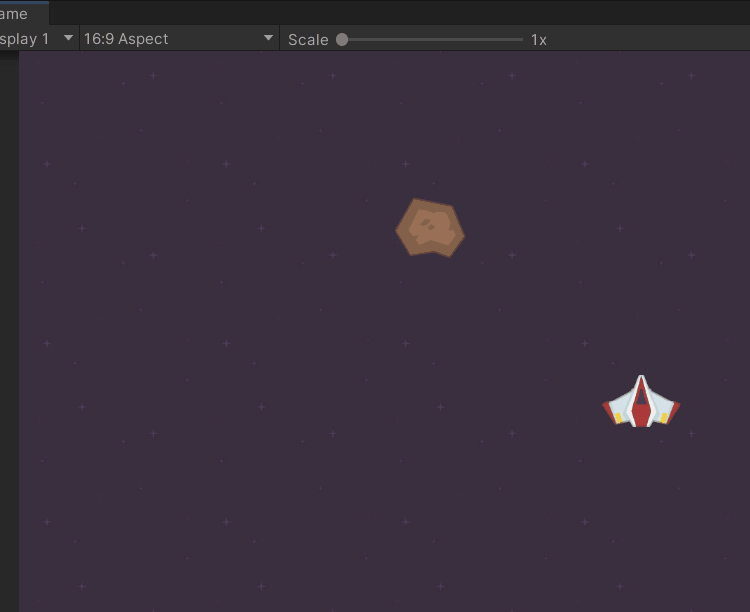

##### Place Spawners

The last thing to do is to turn your *Spawner* Object into a Prefab and place a couple copies of them around the outside of the play area, rotating them to face inwards toward the center. The dispersion will give them wider coverage so there is a possiblity to be hit anywhere on the screen.

Note that even though we're not spawning copies of spawners through code, it's still useful to make a Prefab of the spawner so that you can edit **all** instances of spawners at once just by editing the prefab asset- a great tool for reducing repetitive work down the line.

For my example, I placed three Spawners in a loosely triangular fashion around the outside. I also fired their spawn intervals so that they're not all in sync.

Once that's done, you've finished this base template!

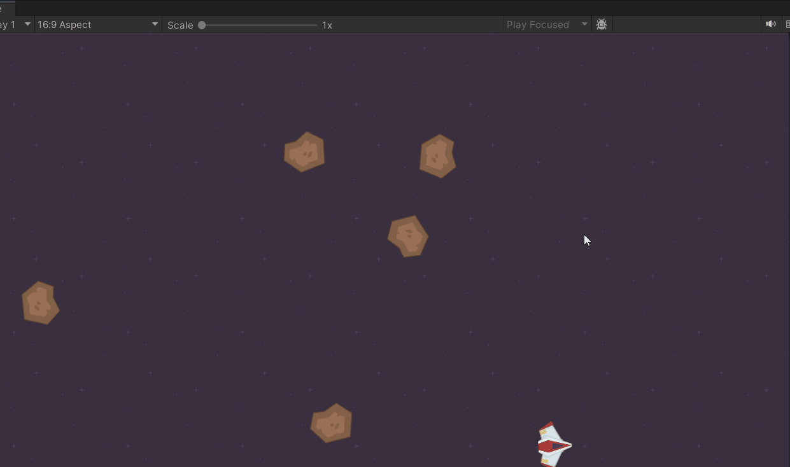

## Conclusion
Congratulations, you've now got a pretty neat game, and you've learned a fair amount of foundational elements to game development! \o/

### What now?

This game, as is mentioned in the article's title, this tutorial leaves you with a nice *template*- you can learn a lot by expanding it with your own features and experimenting. There is a lot you can do to make your version of the game unique from everyone else's. You may have already had some ideas, so try and implement them!

Just do your best to start small to avoid overwhelming yourself or getting frustrated, and **remember that the completed version of this template is available to download off the GitHub page**.

Keep in mind as well that you can completely charge around the art assets if you're not digging the space theme- the top down controller could be used in something like a hunter dodging leopards in the jungle, ships at sea, or a dungeon crawl. Be creative!


#### Ideas for Expansion
Here are some ideas of things you could do if you need inspiration:

* Add sound effects and particle effects for player / enemy death, laser shooting, flying, etc. This will really make your game pop!
* Make the enemy's *Visuals* Game Object rotate to make the asteroids appear to spin through the air.
* Create a game over screen when the player dies which reports time survived, allows them to restart, and quit the game.
* Create a main menu before the game starts.
* Stop the player from flying outside of the screen boundaries.
* Make the enemies spawn faster as the player survives longer.
* Create some new enemy types:
    * A slower but much larger enemy.
    * An enemy which breaks into two smaller ones when destroyed.
    * An enemy which takes multiple shots to destroy.
* Make some enemies drop a power up that increases the player's rate of fire.
* Add some more detail to the background- far off planets, asteroids flying around, etc.