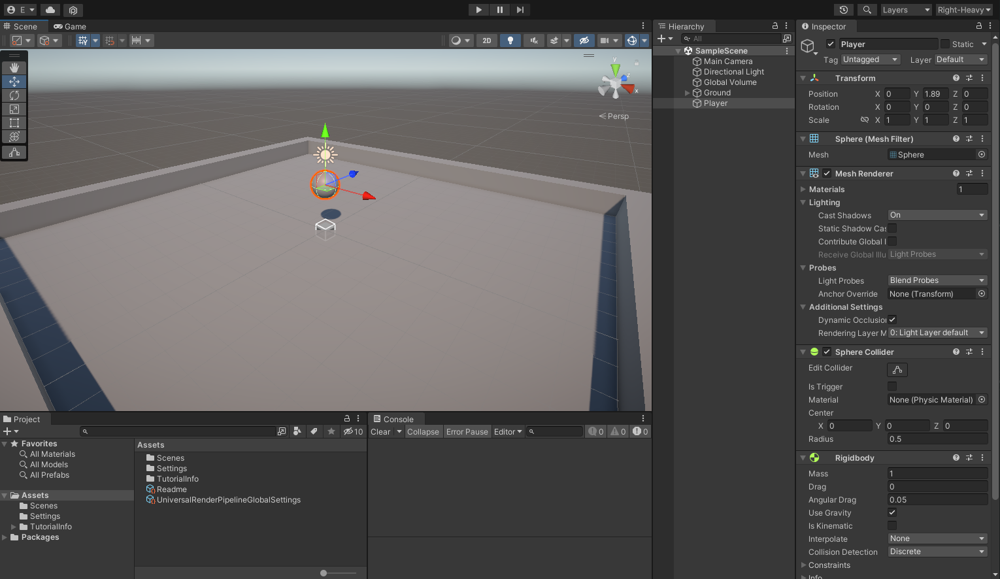
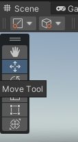
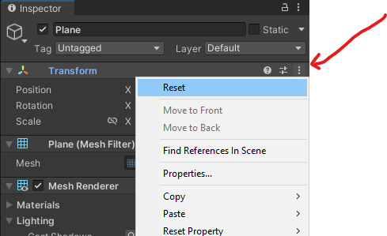
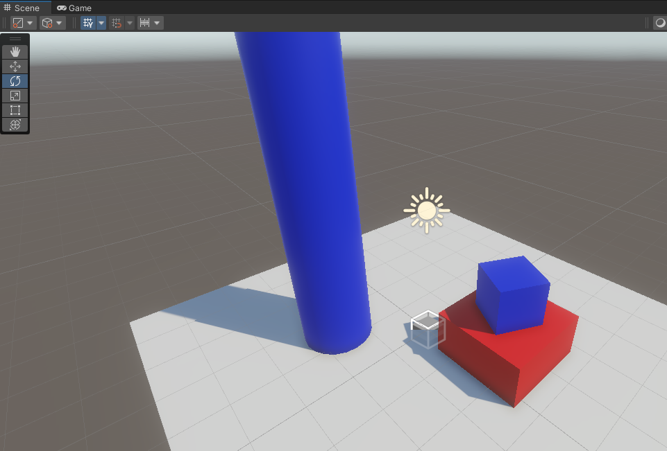
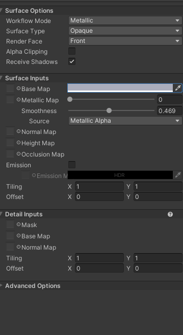

# Introduction to the Editor
*By Jake Rogers*

## Introduction
This article will familiarize new Unity users with some important features of the editor.  

The article is pretty much a written version of my YouTube video linked below, it is recommended to watch that to learn the editor, and use this article as a reference later.

<iframe width="560" height="315" src="https://www.youtube.com/embed/TnI1a0hayEY" title="YouTube video player" frameborder="0" allow="accelerometer; autoplay; clipboard-write; encrypted-media; gyroscope; picture-in-picture; web-share" allowfullscreen></iframe>

## Overview
Upon opening Unity, you will be presented with the default layout of Unity's most important windows. Here is a brief breakdown of each window's function:

* **Project**
    * Shows you your project's file system rooted at the 'Assets' folder. More importantly, it allows you to create Unity specific files such as new materials, scenes, scripts, etc.
    * Files here can be selected in order to edit them in the inspector (upcoming).
* **Console**
    * Logs the INFO, WARN, and ERROR messages created by any script in your project. Think of it as where you would print "Hello World!" to in your first program.
    * Most of the time (hopefully), this window will be empty while you are not in Play Mode, but it is possible to get console output while just using the Editor.

* **Scene View**
    * Your view into your game's current scene as an *editor*, you can freely position the camera in this view.
    * Compared to the *game* view, you will see gizmos and widgets in your game world, have the ability to enable special rendering modes (wireframe, unlit), and *select GameObjects in the hierarchy by clicking on them*.

* **Game View**
    * This view (mostly) directly mimics what your scene looks like when in Play mode. You will see the scene through the perspective of the scene's main camera.

* **Hierarchy**
    * This very important window shows you all of the GameObjects within the currently active scene, as well as presenting them in a hierarchical manner if any GameObjects are nested within each other (they won't be for a fresh project).
    * From this window, GameObjects can be inspected, renamed, re-parented, and more.

* **Inspector**
    * This window is your best friend. Any currently selected GameObject or file in the Project window will show up in the Inspector. From there, you will have the ability to edit all kinds of properties of the item, as well as the properties of components for GameObjects.

???+ info "More Windows"
    There are many, many more windows which can be spawned by using the Window dropdown at the top of the Editor, but they usually are not important enough to have docked at all times.

### Editor Layouts
The editor's layout can be re-organized in practically any way you desire. To do so, simply drag the tab representing the window to another location. You can split docks into two, tabulate them with other windows in a dock, or push them along the sides to create new docks. They can also of course be resized.  
Frankly, just try dragging a window all over the editor to see what options are available.

#### Save Layouts
If you change your layout from the default, it may reset back to the default the next time you open the editor. Therefore, you should **save your current layout** using the drop down in the top right.

Keep in mind, you can save multiple layouts for different workflows- have a workflow completely dedicated to animation or compositing.

???+ tip
    I personally find the default layout annoying, since you have to drag your mouse across the entire screen to go back and forth between the Hierarchy and the Inspector windows- something I do often.

    My 'Right-Heavy' layout moves the Hierarchy to be docked just left of the Inspector, which also gives me a nice and large dock for the Scene and Game views.

    Additionally, I often use Editor scripts which may print to the Console while I am in edit mode, so I split the Console and Project windows into two docks along the bottom so they are always open.

## Hierarchy
In order to explore the other windows in more detail, we should add some GameObjects to our scene! In general, we use the Hierarchy to do this.

Right-click on any empty space within the Hierarchy to get a drop-down menu of new GameObjects you can create. Pick `3D Object -> Plane`.

A new GameObject "Plane" will appear at the bottom of your hierarchy. You may have also noticed the new geometry added in the scene view! Let's rename the plane to "Ground" by selecting it and pressing ++f2++ to rename it.

Well, you are basically a pro now. Try adding two new "Cube" objects and one new "Cylinder" to the hierarchy- they will also be in the `3D Object` section. Rename the Cubes to "Bottom" and "Top", and the Cylinder to "Pillar", and I will meet you over in the scene view!

## Scene View
### Movement
Now that we have some items in our scene view to give us a frame of reference, let's learn how to move our scene camera.

* **Orbit**
    * To Orbit the camera, hold down ++alt++, then click-drag your cursor along the scene view. This will spin your camera about an imaginary pivot some distance in front of you.
* **Zoom**
    * To Zoom the camera, scroll your scroll wheel *or* hold down ++alt++ and drag with the right mouse button.
    * Note that zoom in will bring you closer to the "imaginary pivot point" in front of your camera, so you can only zoom in so far. Try zooming in very close and then orbiting if you are confused.

* **Pan**
    * To Pan the camera, hold down the middle-mouse button and drag (You may have to hold ++alt++ first, depending on your pointer device).

* **Flythrough**
    * Flythrough allows you to navigate your scene with flight controls. To start flythrough mode, hold down right-click on your Scene View.
        * To move, use ++w++, ++a++, ++s++, and ++d++ to move horizontally. ++q++q++ & ++e++ can be used to move up or down relative to the camera.
        * Hold ++shift++ while moving like this to move faster.
        * Move your mouse to change the orientation of the camera.

* **Focus**
    * When an item is selected in the Hierarchy, you can press ++f++ with your cursor over the Scene View to move your camera to the correct zoom and location to view the entire selected object.
    * You can also do this by double-clicking any object in the Hierarchy.
    * This is very useful if you have taken your camera on a while adventure and need to find your scene again!

Note that new GameObjects spawned in the Hierarchy will be initially created at your camera's pivot point, not at the scene origin (0, 0, 0).

### Make a Basic Scene
Let's use those primative shape GameObjects we spawned in the Hierarchy to make a basic level.

#### Move (Translation)
Your Scene View has a 'Tool Shelf' which gives you the ability to intuitively change a selected GameObject's Transform. Select the 'Move Tool', then select the "Ground" Plane.

If you cannot see your Ground plane, press ++f++ in the Scene View to focus the selected object. You should see a large, Red, Green, and Blue gizmo. Clicking and dragging on the Gizmo's handles will let you move the plane in the X, Y, and Z axis respectively. Give it a try.

If you want some more control over your GameObject's transformations, take a look over on the Inspector window while it is selected. *All* GameObjects have a Transform component which dictates it's position within the scene (The Scene View tools are actually just tools for manipulating values in the Transform component!).

You can type in exact values for your GameObject's Position, Rotation, and Scale here, which is very useful for making things line up perfectly.

Traditionally, we like to keep our scenes centered around the origin point (0, 0, 0), so let's actually zero-out all the position elements in the Plane's Transform component.

???+ tip "Component Reset"
    You can clear out *all* Transform values by 'resetting' the Transform component.

    In fact, you can do this for any component. The *reset* option will set all properties to the component's default values.
    

#### Scale
We would like to make our Ground plane bigger, in the Scene View's Tool Shelf, select the 'Scale Tool', and some new Gizmos will appear on your selected object.

Drag the red (X) and blue (Z) handles to make the plane a bit bigger. If you prefer typing in the values, set the X and Z Scale values of the plane to `2`.

#### Free Build
We have a nice Ground for a scene! Now, use the techniques listed above to position your two cubes and the cylinder in the scene.

Make the 'Pillar' taller and a bit wider, and move it around so that it is resting just on top of the Ground plane (but not intersecting it).

Make the 'Bottom' cube a bit wider (but not taller), and also bring it up to rest on the ground plane. Keep the 'Top' cube the same size, but position it on top of the 'Bottom' cube.

#### Rotation
Select the 'Top' cube and then select the 'Rotate Tool'. The gizmo for the rotate tool looks a bit more complicated, but it allows you to spin a GameObject in 3D space.

Give the 'Top' cube a bit of Y-axis rotation (more formally known as 'X-Z' Plane rotation) by click-dragging your cursor along the green ring.

The final result should look something like this (Ignore the colors, we'll get to that!)

## Add Some Color!
Lets add some color to our primitive shapes. In Unity, **Materials are resources which describe how a 3D mesh should look** when rendered to the screen, handling things like color, light reflectivity, special mapping, and other effects. We just need to create some materials that we can apply to our objects to give them different color.

### Create New Materials
Things like Materials are created view the Project Window. Right-Click on the 'Assets' folder and select `Create -> Folder`, name that folder 'Materials'.

Note that this folder doesn't *need* to be called 'Materials' to work properly, we are just keeping our file system neat. 

A new 'Materials' folder will be created, click on it to open the empty folder. In any empty space within it, Right-Click and select `Create -> Material`. We will call our first Material 'Ground', then select it so it shows up in the Hierarchy.

In brief, Materials allow the selection of special graphics programs called 'Shaders' which will determine how any mesh they are attached to should be rendered. 

The default `Universial Render Pipeline/Lit` shader is a general shader using Physically Based Render (PBR) techniques to enable some cool interactions with light. The parameters you see available in the Inspector are provided by the selected shader; an `Unlit` shader would just have a 'Base Map' parameter, for example.

For this Ground material, we will select the Base Map and change it's color to a pure white. Click on the Color Bar and use the Color Wheel to do this.

Great! Before we apply these Materials, select the "Ground" material in the Project window and press `Ctrl+D` twice to duplicate two more materials. Call one of them 'Primary' and one of them 'Secondary'.

For our purposes, we will need to create a new material per each color we would like to use in our scene. Change the Base Map of the Primary and Secondary materials to any two colors of your choosing. 

You can use the 'Outer Ring' of the Color Selector to change the hue of your color.

### Apply Materials
We created materials, but we still need to apply them. You can drag-and-drop the material from your Project window onto the target GameObject in the Scene View or Hierarchy window to set their material.

1. Apply the 'Ground' material to the Ground Plane
2. Apply the 'Primary' material to the Top cube and the Pillar
3. Apply the 'Secondary' material to the Bottom cube.

Notice that we reused the Primary material on two different GameObjects? The neat thing about that is that if you go back and edit your Primary material, you will notice the changes update in real-time on **both** meshes!

If you want, try messing around with the Metallic and Smoothness sliders on your materials to see how they effect them.

## Conclusion
You now have some basic knowledge of using the Unity editor to build a simple scene by learning the following:

* Using the Project window to manage and create new resources.
* Using the Hierarchy to create new GameObjects and meshes.
* Using the Inspector to edit GameObjects and Project resources.
* Navigating the Scene View and using Transform Tools to move GameObjects.
* Creating materials to change the way meshes are rendered.
